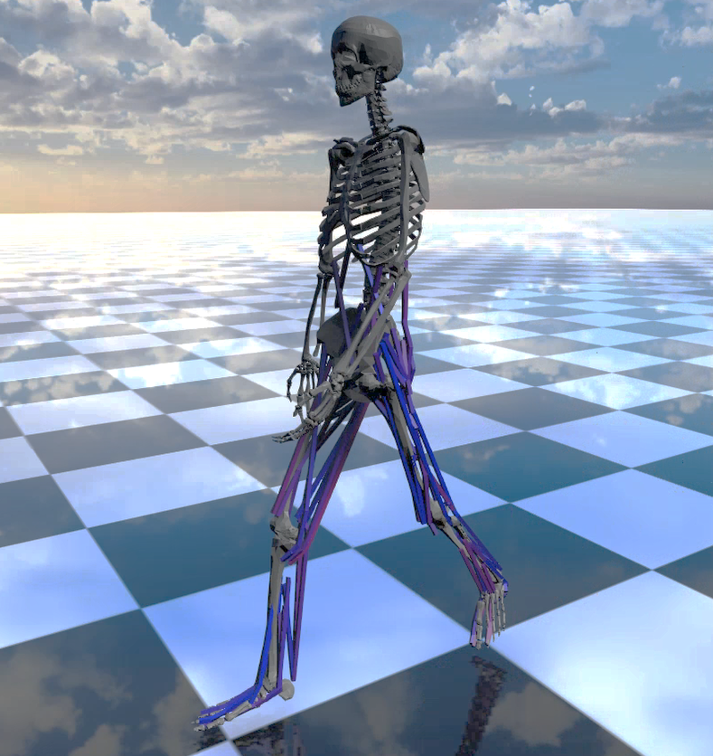

#############################
RaiSim
#############################

RaiSim is a cross-platform multi-body physics engine for robotics and AI.
It fully supports **Linux**, **Mac Os**, and **Windows**.
RaiSim is closed-source and is distributed under a few different types of license. Please check License section for details.

Examples
========

.. image:: image/demo_robots.gif
  :alt: RaiSimPy demo (robots.py)
  :width: 600

**RaisimPy example** in ``raisimPy/examples/robots.py``

**Biomechanical simulation**, created by Young-Jun Koo, PhD and Seungbum Koo, PhD at Musculoskeletal BioDynamics Lab, KAIST.

The geometric model is created using the Full-body musculoskeletal model in Rajagopal et al. (2016).

.. image:: image/huskyScan.gif
  :alt: husky
  :width: 600

**Ray Test example with Husky and Velodyne**

.. image:: image/anymals.png
  :alt: anymals
  :width: 600

**ANYmal B and C robots**, by ANYbotics AG.

.. image:: image/trackedRobot.gif
  :alt: trackedRobot
  :width: 600

**Simple URDF by RaiSim Tech.**

.. toctree::
   :maxdepth: 1
   :caption: Get started

   sections/License
   sections/Acknowledgement
   sections/Support
   sections/Performance
   sections/ChangeLog

.. toctree::
   :maxdepth: 1
   :caption: RaiSim C++

   sections/Introduction
   sections/Installation
   sections/ConventionsAndNotations
   sections/Math
   sections/LoggingSystem
   sections/WorldSystem
   sections/WorldConfigurationFile
   sections/RaisimServer
   sections/Object
   sections/Contact
   sections/MaterialSystem
   sections/HeightMap
   sections/Constraints
   sections/RayTest

.. toctree::
   :maxdepth: 1
   :caption: Related Software

   sections/RaisimGymTorch
   sections/RaiSimPy
   sections/RaisimUnity
   sections/RaiSimMatlab