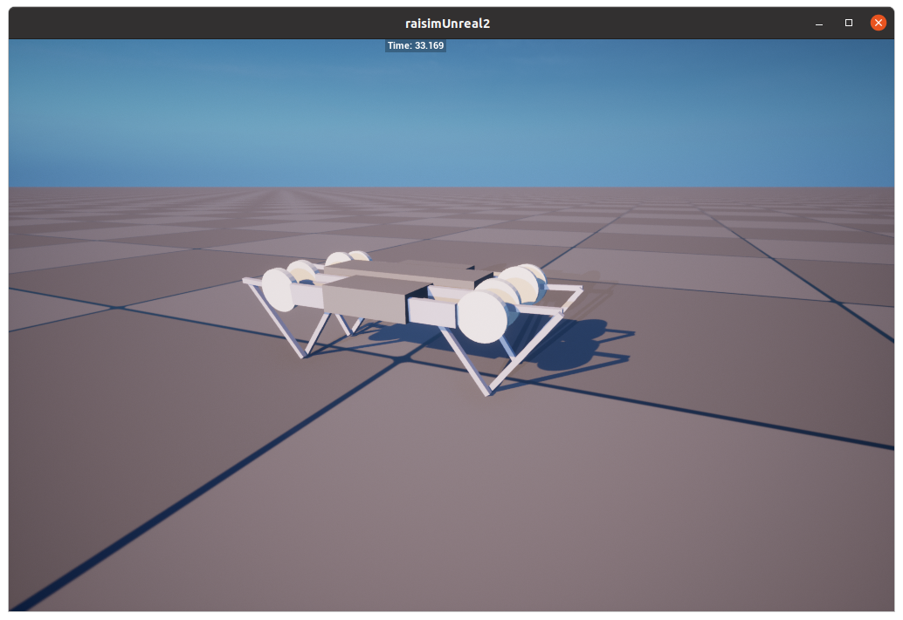
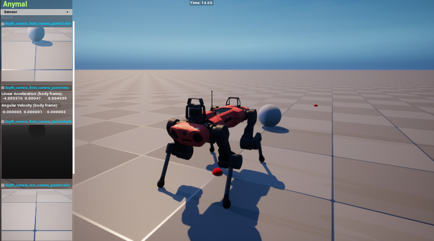
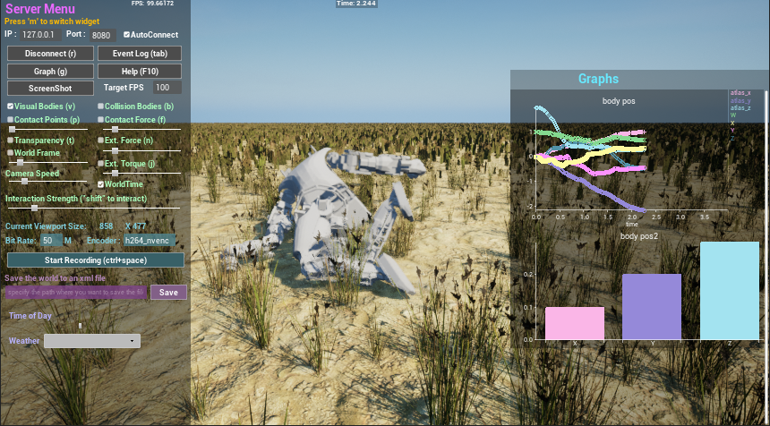
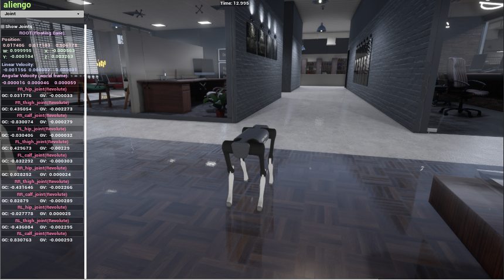

#############################
RaiSim v1.1.7
#############################

RaiSim is a cross-platform multi-body physics engine for robotics and AI.
It fully supports **Linux**, **Mac Os**, and **Windows**.
RaiSim is closed-source and is distributed under a few different types of license. Please check License section for details.

Examples
========

**raisim example** (closed-loop) `minitaur.cpp <https://github.com/raisimTech/raisimLib/blob/master/examples/src/server/minitaur.cpp>`_

**raisim example** `sensors.cpp <https://github.com/raisimTech/raisimLib/blob/master/examples/src/server/sensors.cpp>`_

**raisim example** `atlas.cpp <https://github.com/raisimTech/raisimLib/blob/master/examples/src/maps/atlas.cpp>`_

**raisim example** `office1.cpp <https://github.com/raisimTech/raisimLib/blob/master/examples/src/maps/office1.cpp>`_

.. image:: image/demo_robots.gif
  :alt: RaiSimPy demo (robots.py)
  :width: 600

**RaisimPy example** `robot.py <https://github.com/raisimTech/raisimLib/blob/master/raisimPy/examples/robots.py>`_

.. image:: image/skeleton.bmp
  :alt: Skeleton img from S. K at KAIST
  :width: 600

**Biomechanical simulation**, created by Young-Jun Koo, PhD and Seungbum Koo, PhD at Musculoskeletal BioDynamics Lab, KAIST.

The geometric model is created using the Full-body musculoskeletal model in Rajagopal et al. (2016).

The KAIST team provided this image but we do not have this model in this repo.

.. image:: image/huskyScan.gif
  :alt: husky
  :width: 600

**raisim example** `rayDemo2.cpp <https://github.com/raisimTech/raisimLib/blob/master/examples/src/server/rayDemo2.cpp>`_

.. image:: image/anymals.png
  :alt: anymals
  :width: 600

**raisim example** `anymals.cpp <https://github.com/raisimTech/raisimLib/blob/master/examples/src/maps/anymals.cpp>`_

.. image:: image/trackedRobot.gif
  :alt: trackedRobot
  :width: 600

**raisim example** `trackedRobotAndTemplatedURDF.cpp <https://github.com/raisimTech/raisimLib/blob/master/examples/src/server/trackedRobotAndTemplatedURDF.cpp>`_

.. toctree::
   :maxdepth: 1
   :caption: Get started

   sections/License
   sections/Acknowledgement
   sections/Support
   sections/Performance
   sections/ChangeLog

.. toctree::
   :maxdepth: 1
   :caption: RaiSim C++

   sections/Introduction
   sections/Installation
   sections/Visualizers
   sections/ConventionsAndNotations
   sections/Determinism
   sections/Math
   sections/LoggingSystem
   sections/WorldSystem
   sections/WorldConfigurationFile
   sections/RaisimServer
   sections/Object
   sections/Contact
   sections/MaterialSystem
   sections/HeightMap
   sections/Constraints
   sections/RayTest
   sections/Sensors

.. toctree::
   :maxdepth: 1
   :caption: Related Software

   sections/RaisimGymTorch
   sections/RaiSimPy
   sections/RaisimUnity
   sections/RaisimUnreal
   sections/RaiSimMatlab