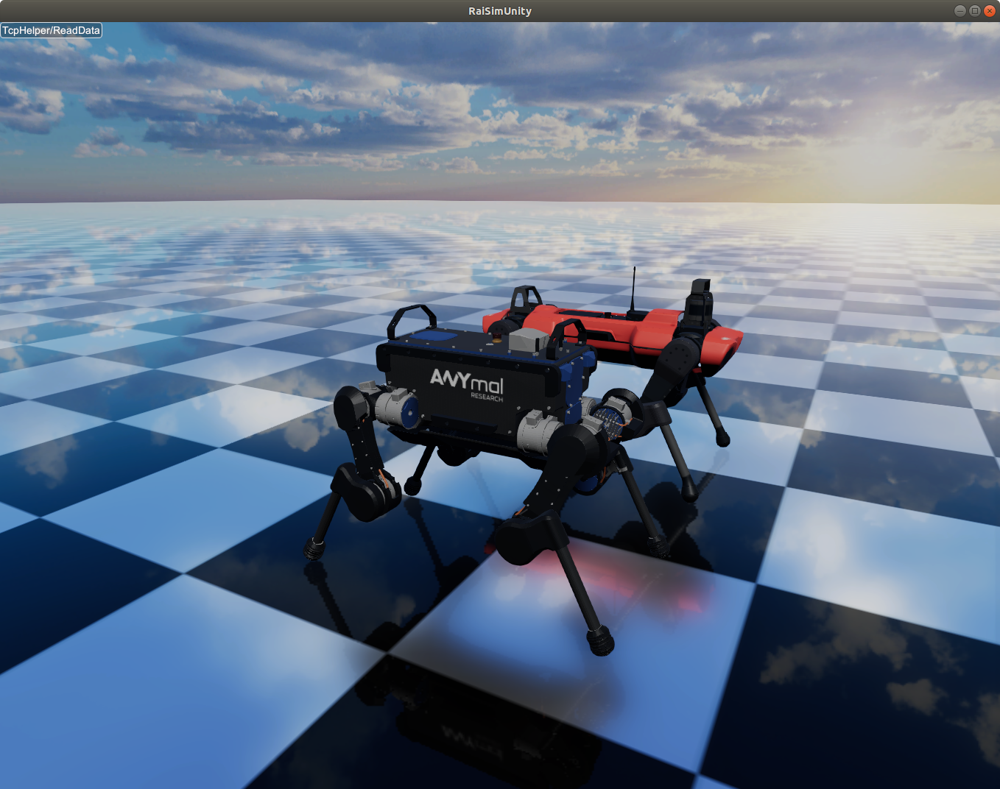
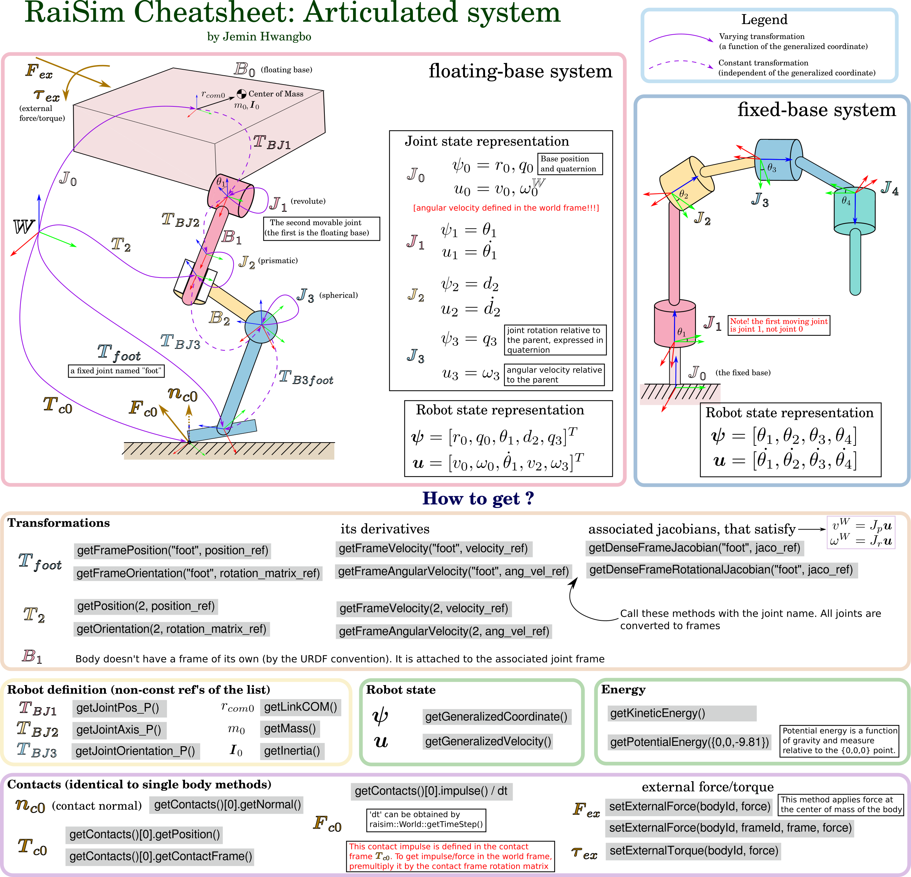

#############################
Articulated Systems
#############################

ANYmal robots (B and C versions) simulated in RaiSim.

TL;DR
=============================

Click the image for vector graphics

  
Introduction
=============================

An articulated Systems is a system of multiple bodies connected through joints.
There are two types of articulated systems: *Kinematic trees* and *closed-loop systems*. 
Kinematic trees do not contain a loop (a body always has only one parent joint).
Consequently, the number of joints is equal to the number of bodies (for floating systems, we assign a floating joint on the root body).
RaiSim can only simulate **kinematic trees**.

**Since all bodies have one joint, a body index is always the same as its parent joint's index**.
A *body* refers to a rigid body which is composed of one or more *links*. All links within a body are connected to each other by a fixed joint.

Creating an instance
=============================
Just like any other object, an articulated system is created by the world instance using :code:`addArticulatedSystem` method.
There are three ways to specify the system.

1. by providing the path to the URDF file (the most recommneded way)
2. by providing :code:`std::string` of the URDF text (can be useful when working with Xacro)
3. by providing a :code:`raisim::Child` instance. It is an advanced method and not recommnded to beginners.

Note that option 1 and 2 use the same method. 
You can provide either the path string or the contents string and the class will identify which one is provided.

State Representation
=============================
The state of an articulated system can be represented by a **generalized state** :math:`\boldsymbol{S}`, which is composed of a **generalized coordinate** :math:`\boldsymbol{q}` and a **generalized velocity** :math:`\boldsymbol{u}`.
Since we are not constraining their parameterization, in general, 

.. math::

  \begin{equation}
    \boldsymbol{u}\neq\dot{\boldsymbol{q}}.
  \end{equation}

A generalized coordinate fully represents the configuration of the articulated system and a generalized velocity fully represents the velocity state of the articulated system.

Every joint has a corresponding generalized coordinate and generalized velocity.
A concatenation of all joint generalized coordinates and velocities are the generalized coordinates and velocities of the articulated system, respectively.
The order of this concatenation is called **joint order**.
The joint order is determined by the order the joint appears in the URDF unless otherwise it is explicitly given at the instance construction time.
The joint order can be accessed through :code:`getMovableJointNames()`.
Note the keyword "movable".
The fixed joints contribute to neither the generalized coordinate nor the generalized velocity.
Only movable joints do (with one exception metioned below). 

The joint order starts with the **root body** which is the first body of the articulated system. 
For floating-base systems, the root body is the floating base.
For fixed-base systems, the root body is the one rigidly attached to the wolrd.
Even though the fixed base cannot move physically, users can move them using :code:`setBaseOrientation` and :code:`setBasePosition`.
So :code:`getMovableJointNames()` method will return the fixed base name and the fixed base joint is a part of the joint order.

The following example illustrates how the generalized coordinates and velocities are defined.

To set the state of the system, the following methods can be used

* :code:`setGeneralizedCoordinate`
* :code:`setGeneralizedVelocity`
* :code:`setState`

To obtain the state of the system, the following methods can be used

* :code:`getGeneralizedCoordinate`
* :code:`getGeneralizedVelocity`
* :code:`getState`

The dimensions of each vector can be obtained respectively by

* :code:`getGeneralizedCoordinateDim`
* :code:`getDOF` or :code:`getGeneralizedVelocityDim`. 

These two methods are identical

.. _articulated_systems:

Joints
=============================

Here are the available joints in RaiSim.

.. list-table:: Joint Properties (:math:`|\cdot|` is a symbol for dimension size (i.e., cardinality))
   :widths: 14 14 15 14 14 14
   :header-rows: 1

   * -
     - Fixed
     - Floating
     - Revolute
     - Prismatic
     - Spherical
   * - :math:`|\boldsymbol{u}|`
     - 0
     - 6
     - 1
     - 1
     - 3
   * - :math:`|\boldsymbol{q}|`
     - 0
     - 7
     - 1
     - 1
     - 4
   * - Velocity
     -
     - :math:`m/s`, :math:`rad/s`
     - :math:`rad/s`
     - :math:`m/s`
     - :math:`rad/s`
   * - Position
     -
     - :math:`m`, :math:`rad`
     - :math:`rad`
     - :math:`m`
     - :math:`rad`
   * - Force
     -
     - :math:`N`, :math:`Nm`
     - :math:`Nm`
     - :math:`N`
     - :math:`Nm`

The generalized coordinates/velocities of a joint are expressed in the **joint frame** and with respect to the **parent body**.
Joint frame is the frame attached to every joint and fixed to the parent body.
Parent body is the one closer to the root body among the two bodies connected via the joint.
Note that the angular velocity of a floating base is also expressed in the parent frame (which is the **world frame**).
Other libraries (e.g., RBLD) might have a different convention and a special care has to be taken in conversions.

URDF convention
=============================
RaiSim uses a modified URDF protocol to define an articulated system.
URDF files following the original convention can be read in RaiSim.
However, since RaiSim offers more functionalities, a RaiSim URDF might not be read by other libraries following the original URDF convention.

The modifications are as follows:

* Capsule geom is available for both collision objects and visual objects (with the keyword "capsule"). The geom is defined by "height" and "radius" keyword. The height represents the distance between the two center points of the spheres.

* A <joint>/<dynamics> tag can have three more attributes: *rotor_inertia*, *spring_mount* and *stiffness*.

Here is an example joint with the raisim tags

.. code-block:: xml

    <joint name="link1Tolink2" type="spherical">
        <parent link="link1"/>
        <child link="link2"/>
        <origin xyz="0 0 -0.24"/>
        <axis xyz="0 1 0"/>
        <dynamics rotor_inertia="0.0001" spring_mount="0.70710678118 0 0.70710678118 0" stiffness="500.0" damping="3."/>
    </joint>

**Rotor_inertia** in Raisim approximately simulates the rotor inertia of the motor (but missing the resulting gyroscopic effect, which is often neglegible).

It is added to the diagonal elements of the mass matrix.
It is common way to include the inertial effect of the rotor.
You can also override it in C++ using :code:`setRotorInertia()`.
Since RaiSim does not know the gear ratio, you have to multiply the rotor inertia by the square of the gear ratio yourself.
In other words, the value is the reflected rotor inertia observed at the joint.

And two preprocessor features (that are also available in the raisim world configuration file) are available for the URDF template.

* You can specify a variable in a form of "@@Robot_Height". The value of this variable can be specified at the run timeusing ''std::unordered_map'' and the corresponding factory method in ''raisim::World::.

* You can specify an equation instead of a variable. For example, {@@Robot_Height*@@Robot_Width*2}.

The preprocessor example can be found in ``examples/src/server/trackedRobotAndTemplatedURDF.cpp`` and the corresponding URDF template in ``rsc/templatedTrackedRobot/trackedTemplate.urdf``.

In RaiSim, each body of an articulated system has a set of collision bodies and visual objects.
Collision bodies contain a collision object of one of the following shapes: *mesh*, *sphere*, *box*, *cylinder*, *capsule*.
Visual objects just store specifications for visualization and the actual visualzation happens in a visualizer (e.g., `raisimOgre <https://github.com/leggedrobotics/raisimOgre>`_)
For details, check the `URDF protocol <http://wiki.ros.org/urdf/XML>`_.

Kinematics
=============================

Frames
****************************

A position and velocity of a specific point on a body of an articulated system can be obtained by attaching a **frame**.
**Frames** are rigidly attached to a body of the system and has a constant position and orientation (w.r.t. parent frame).
It is the most recommended way to get kinematics information of a point of an articulated system in RaiSim.

All joints have a frame attached and their names are the same as the joint name.
To create a custom frame, a fixed frame can be defined at the point of the interest.
A dummy link with zero inertia and zero mass must be added on one side of the fixed joint to complete the kinematic tree.

A frame can be locally stored as an index in the user code. For e.g.,

.. code-block:: c

  #include “raisim/World.hpp”

  int main() {
    raisim::World world;
    auto anymal = world.addArticulatedSystem(PATH_TO_URDF);
    auto footFrameIndex = anymal->getFrameIdxByName("foot_joint"); // the URDF has a joint named "foot_joint"
    raisim::Vec<3> footPosition, footVelocity, footAngularVelocity;
    raisim::Mat<3,3> footOrientation;
    anymal->getFramePosition(footFrameIndex, footPosition);
    anymal->getFrameOrientation(footFrameIndex, footOrientation);
    anymal->getFrameVelocity(footFrameIndex, footVelocity);
    anymal->getFrameAngularVelocity(footFrameIndex, footAngularVelocity);
  }

You can also store a Frame reference. 
For e.g., you can replace :code:`getFrameIdxByName` by :code:`getFrameByName` in the above example.
In this way, you can access the internal variables and even modify them.
Modifying the frames do not affect the joints.
Frames are instantiated during initialization of the articulated system instance and affect neither kinematics nor dynamics of the system.

Jacobians
****************************
Jacobians of a point in RaiSim satisfy the following equation:

.. math::

  \begin{equation}
    \boldsymbol{J}\boldsymbol{u} = \boldsymbol{v}
  \end{equation}

where :math:`\boldsymbol{v}` represents the linear velocity of the associated point.
If a rotational Jacobian is used, the right-hand side changes to a rotational velocity expressed in the world frame.

To get the Jacobians associated with the linear velocity, the following methods are used

* :code:`getSparseJacobian`
* :code:`getDenseJacobian` -- this method only fills non-zero values. The matrix should be initialized to a zero matrix of an appropriate size.

To get the rotational Jacobians, the following methods are used

* :code:`getSparseRotationalJacobian`
* :code:`getDenseRotationalJacobian` -- this method only fills non-zero values. The matrix should be initialized to a zero matrix of an appropriate size.

The main Jacobian class in RaiSim is :code:`raisim::SparseJacobian`. 
RaiSim uses only sparse Jacobians as it is more memory-friendly.
Note that only the joints between the child body and the root body affect the motion of the point.

The class :code:`raisim::SparseJacobian` has a member :code:`idx` which stores the indicies of columns whose values are non-zero.
The member :code:`v` stores the Jacobian except the zero columns.
In other words, ith column of :code:`v` corresponds to :code:`idx[i]` generalized velocity dimension.

Dynamics
=============================
All force and torque acting on the system can be represented as a single vector in the generalized velocity space.
This representation is called **generalized force** :math:`\boldsymbol{\tau}`.
Just like in a Cartesian coordiate (i.e., x, y, z axes), the power exerted by an articulated system is computed as a dot product of generalized force and generalized velocity (i.e., :math:`\boldsymbol{u}\cdot\boldsymbol{\tau}`).

We can also combine the mass and inertia of the whole articulated system and represent them in a single matrix.
This matrix is called **mass matrix** or **inertia matrix** and denoted by :math:`\boldsymbol{M}`. 
A mass matrix represents how much the articulated system resists change in generalized velocities.
Naively speaking, a large mass matrix means that the articulated system experiences a low velocity change for a given generalized force.

The total kinetic energy of the system is computed as :math:`\frac{1}{2}\boldsymbol{u}^T\boldsymbol{M}\boldsymbol{u}`.
This quantity can be obtained by :code:`getKineticEnergy()`.

The total potential energy due to the gravity is a sum of :math:`mgh` for all bodies.
This quantity can be obtained by :code:`getPotentialEnergy()`.
Note that the gravity has to be specified since only the world has the gravity vector.

The equation of motion of an articulated system is shown below:

.. math::

  \begin{equation}
     \boldsymbol{\tau} = \boldsymbol{M}(\boldsymbol{q})\dot{\boldsymbol{u}} + \boldsymbol{h}(\boldsymbol{q}, \boldsymbol{u}).
  \end{equation}

Here :math:`\boldsymbol{h}` is called a **non-linear term**. 
There are three sources of force that contributes to the non-linear term: gravity, coriolis, and centrifugal force.
It is rarely useful to compute the gravity contribution to the nonlinear term alone.
However, if it is needed, the easiest way is to make the same robot in another world with zero velocity.
If the generalized velocity is zero, the coriolis and centrifugal contributions are zero.

The following methods are used to obtain dynamic quantities

* :code:`getMassMatrix()`
* :code:`getNonlinearities()`
* :code:`getInverseMassMatrix()`

PD Controller
=============================
When naively implemented, a PD controller can often make a robot unstable.
However, this is often not so bad for robotics since this instability is also present in the real system (discrete-time control system).

For other applications like animation and graphics, it is often desirable to have a stable PD controller when a user wants to keep the time step small.
Therefore, this PD controller exploits a more stable integration scheme and can have much smaller time step than a naive implementation.

**This PD controller does not respect the actuation limits of the robot**.
It uses an implicit integration scheme and we do not even compute the actual torque that is applied to the joints.

To use this PD controller, you have to set the desirable control gains first

.. code-block:: c

  Eigen::VectorXd pGain(robot->getDOF()), dGain(robot->getDOF());
  pGain<< ...; // set your proportional gain values here
  dGain<< ...; // set your differential gain values here
  robot->setPdGains(pGain, dGain);

Note that **the dimension of the pGain vector is the same as that of the generalized velocity NOT that of the coordinate**.

Finally, the target position and the velocity can set as below

.. code-block:: c

  Eigen::VectorXd pTarget(robot->getGeneralizedCoordinateDim()), vTarget(robot->getDOF());
  pTarget<< ...; // set your position target
  vTarget<< ...; // set your velocity target
  robot->setPdTarget(pTarget, vTarget);

Here, **the dimension of the pTarget vector is the same as that of the generalized coordinate NOT that of the velocity**.
This is confusing and might seem inconsistent.
However, this is a valid convention.
The only reason that the two dimensions differ is quaternions.
The quaternion target is represented by a quaternion whereas the virtual spring stiffness between the two orientations can be represented by a 3D vector, which is composed of motions in each angular velocity components.

A feedforward force term can be added by :code:`setGeneralizedForce()` if desired.
This term is set to zero by default.
Note that this value is stored in the class instance and does not change unless the user specifies it so.
If this feedforward force should be applied for a single time step, it should be set to zero in the subsequent control loop (after :code:`integrate()` call of the world).

The theory of the implemented PD controller can be found in chapter 1.2 of this `article <https://www.overleaf.com/read/dbqbgcnhzykq>`_. 
This document is only for advanced users and it is not necessary to use RaiSim.

Integration Steps
=============================
Integration of an articulated systems is performed in two stages: :code:`integrate1` and :code:`integrate2`

The following steps are performed in :code:`integrate1`

1. If the time step is changed, update the damping of the mass matrix (which reflects effective inertial increase due to springs, dampers and PD gains)
2. Update positions of the collision bodies
3. Detect collisions (called by the world instance)
4. The world assigns contacts on each object and computes the contact normal
5. Compute the mass matrix, nonlinear term and inverse inertia matrix
6. Compute (Sparse) Jacobians of contacts

After this step, all kinematic/dynamic proerpties are computed at this stage. 
Users can access them if they are necessary for the controller.
Next, :code:`integrate2` computes the rest of the simulation.

7. Compute contact Properties
8. Compute PD controller (if used), add it to the feedforward force and bound it by the limits
9. Compute generalized forces due to springs and external forces/torques
10. Contact solver (called by the world instance)
11. Integrate the velocity
12. Integrate the position (in a semi-implicit way)

Get and Modify Robot Description in code
============================================
RaiSim allows users modify most of the robot parameters freely in code.
This allows users to create randomized robot model, which might be useful for AI applications (i.e., **dynamic randomization**).
Note that a random model might be kinematically and dynamically unrealistic.
For example, joints can be locked by collision bodies.
In such cases, simulation cannot be performed reliably and it is advised to carefully check randomly generated robot models.

Here is a list of modifiable kinematic/dynamic parameters.

* **Joint Position (relative to the parent joint) Expressed in the Parent Frame**

:code:`getJointPos_P` method returns (a non-const reference to) a :code:`std::vector` of position vectors from the parent joint to the child joint expressed in the respective parent joint frames.
This should be changed with care since it can result in unrealistic collision geometry.
**This method does not change the position of the end-effector with respect to its parent** as the position of the last link is defined by the collision body position, not by the joint position.
The elements are ordered by the joint indicies.

* **Joint Axis in the Parent Frame**

:code:`getJointAxis_P` method returns (a non-const reference to) a :code:`std::vector` of joint axes expressed in the respective parent joint frame.
This method should also be changed with care.
The elements are ordered by the joint indicies.

* **Mass of the Links**

:code:`getMass` method returns (a non-const reference to) a :code:`std::vector` of link masses.
**IMPORTANT! You must call :code:`updateMassInfo`** after changing mass values.
The elements are ordered by the body indicies (which is the same as the joint indicies in RaiSim).

* **Center of Mass Position**

:code:`getBodyCOM_B` method returns (a non-const reference to) a :code:`std::vector` of the COM of the bodies.
The elements are ordered by the body indices.

* **Link Inertia**

:code:`getInertia` method returns (a non-const reference to) a :code:`std::vector` of link inertia.
The elements are ordered by the body indicies.

* **Collision Bodies**

:code:`getCollisionBodies` method returns (a non-const reference to) a :code:`std::vector` of the collision bodies.
This vector contains all collision bodies associated with the articulated system.

:code:`getCollisionBody` method returns a specific collision body instead.
All collision bodies are named "LINK_NAME" + "/INDEX". 
For example, the 2nd collision body of a link named "FOOT" is named "FOOT/1" (1 because the index starts from 0).

The collision bodies is a class that contains position/orientation offset from the parent joint frame, name, parent body index, and ODE collision pointer (:code:`dGeomID`, retrieved using :code:`getCollisionObject`).
The collision geom can be modified using ODE methods (`ODE manual <http://ode.org/wiki/index.php?title=Manual>`_).
Users can also modify the material of the collision body.
This material affects the contact dynamics.

Apply External Forces/torques
=============================
The following two methods are used to apply external force and torque respectively

* :code:`setExternalForce`
* :code:`setExternalTorque`

Collision
==============================
Apart from the collision mask and collision group set in the world, users can also disable a collision between a certain pair of the links with :code:`ignoreCollisionBetween`.

Types of Indicies
=============================
ArticulatedSystem class contains multiple types of indicies. To query a specific quantity, you have to provide an index of the right type. Here are the types of indicies in Articulated Systems

* **Body/Joint Index**: All fixed bodies are combined to a single movable body. Each movable body has a unique body index. Because there is a movable joint associated with a movable body, there is a 1-to-1 mapping between the joints and the bodies and they share the same index. For a fixed-base system, the first body rigidly fixed to the world is body-0. For a floating-base system, the floating base is body-0.
* **Generalized Velocity (DOF) Index**: All joints are mapped to a specific set of generalized velocity indicies.
* **Generalized Coordinate Index**:
* **Frame Index**:

Conversions Between Indicies
*****************************
* A body index to a generalized velocity index: :code:`ArticulatedSystem::getMappingFromBodyIndexToGeneralizedVelocityIndex()`
* A body index to a generalized coordinate index: :code:`ArticulatedSystem::getMappingFromBodyIndexToGeneralizedCoordinateIndex()`

API
====

.. doxygenclass:: raisim::ArticulatedSystem
   :members:

