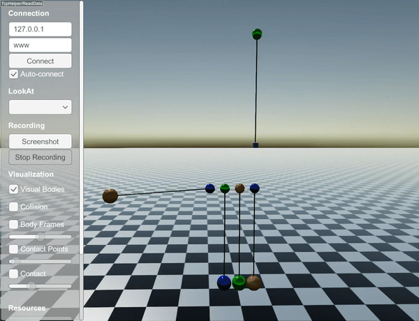

CompliantLengthConstraint
==========================

``CompliantLengthConstraint`` is computed as if it is a pair of external forces.
To simulate a spring attached to a robot joint, you can define it directly in the URDF file.
In that way, more accurate integration schemes can be used.
However, if you want to simulate a compliant constraint between two objects (including articulated systems), ``CompliantLengthConstraint`` is the only way.
To use this constraint, make sure that you set the time step sufficiently small (much smaller than the natural period of the system)

This constraint also offers three stretch types.
For details of the stretch types, please check `StiffLengthConstraint <http://raisim.com/sections/StiffLengthConstraint.html>`_.

A compliant constraint can be added as

.. code-block:: c

  auto pin5 = world.addSphere(0.1, 0.8);
  pin5->setPosition(0.9, 0.0, 6.0);
  pin5->setBodyType(raisim::BodyType::STATIC);
  auto box = world.addBox(.1, .1, .1, 1);
  box->setPosition(0.9, 0.0, 4.0);
  auto wire5 = world.addCompliantWire(pin5, 0, {0,0,0}, box, 0, {0., 0, 0}, 2.0, 200);

The following code will results in

