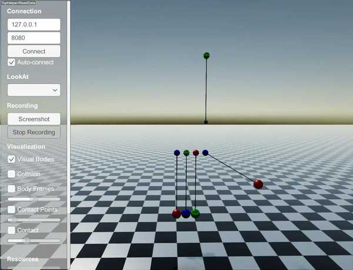

#############################
Constraints
#############################

RaiSim currently has two types of constraints:

.. toctree::
   :maxdepth: 1

   StiffLengthConstraint
   CompliantLengthConstraint
   CustomLengthConstraint

Both constraints offer three stretch types: ``STRETCH_RESISTANT_ONLY``, ``COMPRESSION_RESISTANT_ONLY``, ``BOTH``.
The first two are unilateral constraints (i.e., acting only in one direction) and ``BOTH`` is a bilateral constraint (i.e., acting in both directions).
The stretch types are explained in `StiffLengthConstraint <http://raisim.com/sections/StiffLengthConstraint.html>`_.

You can find a short example in `examples/src/server/newtonsCradle.cpp <https://github.com/raisimTech/raisimlib/blob/master/examples/src/server/newtonsCradle.cpp>`_.
This code simulates the following dynamics

API
====

LengthConstraint
********************

.. doxygenclass:: raisim::LengthConstraint
   :members:

