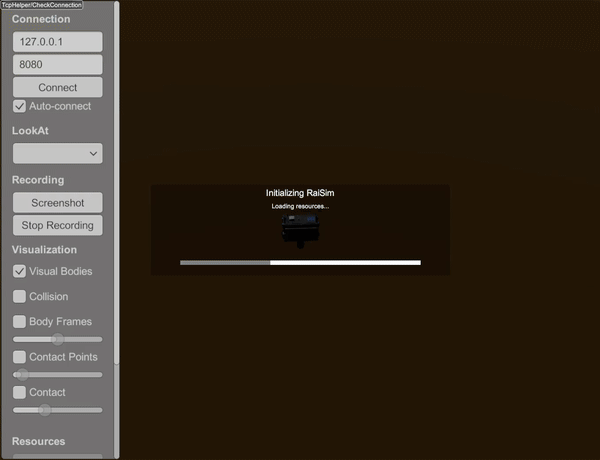

#############################
Height Map Using a PNG File
#############################

XML Way
-----------------------------

Try it yourself with

.. code-block:: bash

    ./xmlReader <PATH_TO_RAISIMLIB>/rsc/xmlScripts/heightMaps/heightMapUsingPng.xml

The xml file is constructed as following:

.. code-block:: xml

    <?xml version="1.0" ?>
    <raisim version="1.0">
        <timeStep value="0.001"/>
        <objects>
            <articulatedSystem name="anymal" resDir="[THIS_DIR]/../../anymal" urdfPath="[THIS_DIR]/../../anymal/urdf/anymal.urdf" collisionGroup="1" collisionMask="-1">
                <state qpos="0, 0, 10.54, 1.0, 0.0, 0.0, 0.0, 0.03, 0.4, -0.8, -0.03, 0.4, -0.8, 0.03, -0.4, 0.8, -0.03, -0.4, 0.8"
                       qvel="0 0 0 0 0 0 0 0 0 0 0 0 0 0 0 0 0 0" />
            </articulatedSystem>
            <heightmap name="terrain" png="[THIS_DIR]/zurichHeightMap.png" xSize="500" ySize="500" centerX="0" centerY="0" heightOffset="-10" heightScale="0.005"/>
        </objects>
        <camera follow="anymal" x="1" y="1" z="1"/>
    </raisim>

C++ Way
-----------------------------

.. code-block:: C++

  auto heightMap = world.addHeightMap("<PATH-TO-PNG>/zurichHeightMap.png", 0, 0, 500, 500, 0.005, -10);
