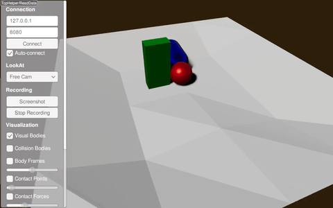

#############################
Height Map Using Raw Values
#############################

XML Way
-----------------------------

Try it yourself with

.. code-block:: bash

    ./xmlReader <PATH_TO_RAISIMLIB>/rsc/xmlScripts/heightMaps/heightMapUsingRawValues.xml

The xml file is constructed as following:

.. code-block:: xml

    <?xml version="1.0" ?>
    <raisim version="1.0">
        <timeStep value="0.001"/>
        <objects>
            <sphere name="sphere" mass="1">
                <dim radius="0.5" />
                <inertia xx="0.1" xy="0" xz="0" yy="0.1" yz="0" zz="0.1" />
                <state pos="0 0 5" quat="1 0 0 0" linVel="0 0 0" angVel="0 0 0" />
            </sphere>
            <capsule name="capsule" mass="1">
                <dim radius="0.5" height="1" />
                <inertia xx="0.1" xy="0" xz="0" yy="0.1" yz="0" zz="0.1" />
                <state pos="1 0 5" quat="1 0 0 0" linVel="0 0 0" angVel="0 0 0" />
            </capsule>
            <box name="box" mass="1">
                <dim x="0.5" y="1" z="2"/>
                <inertia xx="0.1" xy="0" xz="0" yy="0.1" yz="0" zz="0.1" />
                <state pos="1 1 5" quat="1 0 0 0" linVel="0 0 0" angVel="0 0 0" />
            </box>
            <heightmap name="terrain" xSample="5" ySample="5" xSize="10" ySize="10" centerX="0" centerY="0"
                      height="1 1 1 1 1 1 0 0 0 1 1 0.5 0 0 1 1 0 0 0 1 1 1 1 1 1"/>
        </objects>
    </raisim>

C++ Way
-----------------------------

.. code-block:: C++

  std::vector height = {1, 1, 1, 1, 1, 1, 0, 0, 0, 1, 1, 0.5, 0, 0, 1, 1, 0, 0, 0, 1, 1, 1, 1, 1, 1};
  auto heightMap = world.addHeightMap(5, 5, 10, 10, 0, 0, height);

