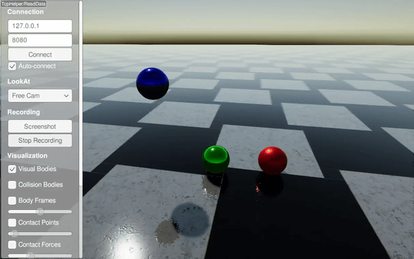

#############################
Material System
#############################

**In RaiSim, all material properties are associated with a material pair.**

Currently, there are five material properties used in RaiSim.

* **Coefficient of friction** (:math:`\mu\ge 0`): This defines how much friction is applied between the two materials
* **Coefficient of restitution** (:math:`c_r\ge 0`): How bouncy the material pair is
* **Restitution Threshold** (:math:`r_{th}\ge 0`): If the impact velocity is smaller than this number, objects do not bounce off
* **Coefficient of static friction** (:math:`\mu_{s}\ge \mu`): If specified, it defines how much friction is applied when the relative velocity between the contact points is very small. By default, it is the same as the coefficient of friction.
* **Velocity threshold for static friction** (:math:`v_s \ge 0`): Must be specified if the coefficient of static friction is specified. If the relative velocity is bigger than this value, than static friction is not used. Otherwise, the effective coefficient of friction is interpolated between the two coefficients.

The bounce velocity is computed as :math:`c_{th}(v_i-c_{th})`, where :math:`v_i` is the impact velocity.
The following graphs describe the effect of the material properties.

Examples can be found in the `restitution example <https://github.com/raisimTech/raisimLib/blob/master/examples/src/server/material.cpp>`_ and `static friction example <https://github.com/raisimTech/raisimLib/blob/master/examples/src/server/materialStaticFriction.cpp>`_.

A material name is set when the material is created.
For example,

.. code-block:: C

  auto ball = world.addSphere(1, 1, "steel");

World owns a materials manager which holds all material pair properties.
Unrecognized material pairs will get **default material properties**, which can be set as :code:`raisim::World::setDefaultMaterial`.
If the default material pair properties are not set, they are {:math:`\mu=0.8`, :math:`c_r=0`, :math:`c_{th}=0`}.

Material properties over a pair can be defined as following

.. code-block:: C++

  world.setMaterialPairProp("steel", "glass", 0.7, 0.1, 0.15);

The first two arguments are the two material names and the following three are the coefficient of friction, coefficient of restitution, and restitution threshold.
The order of the material names does not matter.

Example - Single Bodies
=============================

XML Way
-----------------------------

.. code-block:: xml

    <?xml version="1.0" ?>
    <raisim version="1.0">
        <timeStep value="0.001"/>
        <objects>
            <ground name="ground" material="steel"/>
            <sphere name="sphere_steel" mass="1" material="steel">
                <dim radius="0.5"/>
                <state pos="-2 0 5" quat="1 0 0 0" linVel="0 0 0" angVel="0 0 0"/>
            </sphere>
            <sphere name="sphere_rubber" mass="1" material="rubber">
                <dim radius="0.5"/>
                <state pos="0 0 5" quat="1 0 0 0" linVel="0 0 0" angVel="0 0 0"/>
            </sphere>
            <sphere name="sphere_copper" mass="1" material="copper">
                <dim radius="0.5"/>
                <state pos="2 0 5" quat="1 0 0 0" linVel="0 0 0" angVel="0 0 0"/>
            </sphere>
        </objects>
        <material>
            <default friction="0.8" restitution="0" restitution_threshold="0"/>
            <pair_prop name1="steel" name2="steel" friction="0.8" restitution="0.95" restitution_threshold="0.001"/>
            <pair_prop name1="steel" name2="rubber" friction="0.8" restitution="0.15" restitution_threshold="0.001"/>
            <pair_prop name1="steel" name2="copper" friction="0.8" restitution="0.65" restitution_threshold="0.001"/>
        </material>
        <camera follow="anymal" x="1" y="1" z="1"/>
    </raisim>

C++ Way
-------------------------

.. code-block:: C++

    #include "raisim/RaisimServer.hpp"
    #include "raisim/World.hpp"

    int main(int argc, char* argv[]) {
      auto binaryPath = raisim::Path::setFromArgv(argv[0]);
      raisim::World::setActivationKey(binaryPath.getDirectory() + "\\rsc\\activation.raisim");

      /// create raisim world
      raisim::World world;
      world.setTimeStep(0.001);

      /// create objects
      world.addGround(0, "steel");
      auto sphere1 = world.addSphere(0.5, 1.0, "steel");
      auto sphere2 = world.addSphere(0.5, 1.0, "rubber");
      auto sphere3 = world.addSphere(0.5, 1.0, "copper");

      sphere1->setPosition(-2,0,5);
      sphere2->setPosition(0,0,5);
      sphere3->setPosition(2,0,5);

      world.setMaterialPairProp("steel", "steel", 0.8, 0.95, 0.001);
      world.setMaterialPairProp("steel", "rubber", 0.8, 0.15, 0.001);
      world.setMaterialPairProp("steel", "copper", 0.8, 0.65, 0.001);

      /// launch raisim server
      raisim::RaisimServer server(&world);
      server.launchServer();

      for (int i = 0; i < 10000000; i++) {
        raisim::MSLEEP(1);
        server.integrateWorldThreadSafe();
      }

      server.killServer();
    }

Example - Articulated Systems
==============================

URDF Way
-----------------------------

The material can be specified in the URDF file as following

.. code-block:: XML

    <!-- Foot link -->
    <link name="LF_FOOT">
        <collision>
            <origin xyz="0 0 0.02325"/>
            <geometry>
                <sphere radius="0.035"/>
            </geometry>
            <material name="">
                <contact name="ice"/>
            </material>
        </collision>
    </link>

C++ Way
-----------------------------

Alternatively, you can specify the material dynamically as following

.. code-block:: C++

    anymal->getCollisionBody("LF_FOOT/0").setMaterial("ice");

"LF_FOOT/0" means the first collision body of the link "LF_FOOT".

To get the name of the assigned material, you can call

.. code-block:: C++

    ANYmal->getCollisionBody("LF_FOOT/0").getMaterial();

To get contact properties when it collides with another material, you can use the following line

.. code-block:: C++

    world.getMaterialPairProp(ANYmal->getCollisionBody("LF_FOOT/0").getMaterial(),
                              ground->getCollisionObject().getMaterial());

