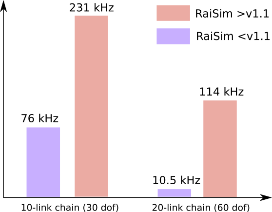

#############################
Performance
#############################

RaiSim Custom Algorithm for Articulated System
===============================================

RaiSim v1.1 brings a totally new simulation scheme.
Older versions of RaiSim (and other simulators like MuJoCo according to its doc) use the following computation scheme for the articulated system forward dynamics.

+ Composite Rigid Body Algorithm (CRBA)
+ Recursive Newton Euler (RNE)
+ Mass matrix inversion using Cholesky factorization.

These algorithms are very efficient in computing the forward dynamics.
However, there is a faster alternative: Articulated Body Algorithm (ABA).
ABA skips the computation of the mass matrix and directly computes the generalized acceleration.
Consequently, it outperforms the CRBA+RNE+Cholesky (CRC) combination by a fairly big margin.

The computational complexity of the CRC is O(n^3), n being the degree of freedom (search for "the big O notation" in wikipedia if you don't know what it is).
This means that the computational cost increases cubic to the degree of freedom of the system.
The computational cost of the ABA is O(n).
Therefore, the ABA is much more efficient than the CRC for high-degree-of-freedom systems.

However, the mass matrix and its inverse are essential in computing many contact related properties that contact solvers need.
This is why the older versions of RaiSim and other simulators use the CRC combo.
Because the ABA does not compute those properties, it was not useful in rigid body simulation.

RaiSim v1.1 is equipped with a family of new algorithms that compute the contact related properties at O(n).
These algorithms do not compute the mass matrix nor its inverse (they have n^2 elements and there is no way to compute them at O(n)).
These properties are in fact not necessary to compute any contact related properties that the RaiSim contact solver needs.
Consequently, **RaiSim (>v1.1) computes the whole forward dynamics of an articulated system at O(n) including contact related properties**.
We cannot share exactly what these algorithms are and what they compute.
They are not published.

What matters to performance
==============================

There are four major computational units in most rigid-body simulators.

1. Collision detection: O(n^2)
2. Forward dynamics computation: O(n)
3. Contact properties computation: O(nm)
4. Contact solver: O(???)

n is the degree of freedom and m is the number of contact points.

In many robotic simulations, **1** is the most time-consuming part.
It is highly recommended that you only model necessary collision bodies.
Otherwise, you are not exploiting the fast rigid-body simulation pipeline in **2**, **3** and **4**.

When there is no collision, the simulation time should be roughly linear to the degree of freedom of the system.
Here is a plot showing the scaling.

As shown above, we can simulate a 60-dof system at 114 kHz.

The model used above does not have a collision body.
If you have a big system like the 60-dof chain, the collision detection will take most of the time.
So it is important to model only important collision bodies.

The new simulation scheme is on average faster than the old scheme.
However, **3** in the old scheme is faster because the computation of the inverse mass matrix helps the computation of **3**.
Our O(n) algorithm is very close to the old scheme even without the inverse mass matrix but there is still a small gap.
Consequently, the old scheme might be faster if there are many contact points.

For the ANYmal robot without collision, the new scheme runs at 318 kHz.
This is faster than the old version which runs at 272 Hz.

All simulation tests were performed on a single core of 3950X, which is not excellent at single-thread performance.
The current best single-thread cpu (for RaiSim at least) is Apple's M2.
The ANYmal simulation without contacts runs at 380 kHz on M1.

Linux and OSX are the best for high-speed simulation applications.
In Windows, you get less than half the performance because it is compiled with MSVC, which is bad optimizing math operations.

The computational speed of **4** becomes very significant when there are more than 10 coupled contact points.
Therefore, it is important to check if there are unnecessary contact points.
The computational cost of **4** is highly dependent on their nature of coupling.
If they are not coupled at all, the computational cost is O(n).
If they are highly coupled, the computational cost becomes NP hard, which means that it is no longer a polynomial relationship.
