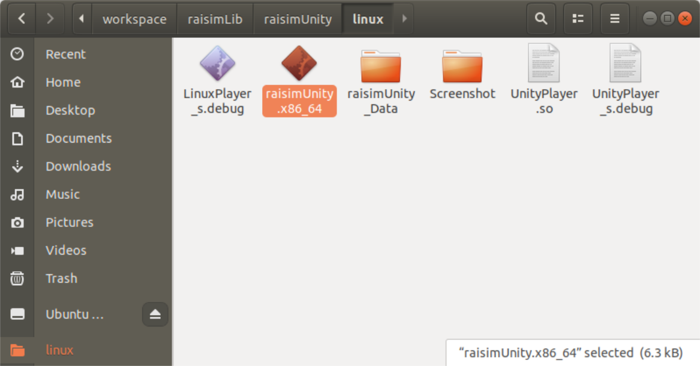
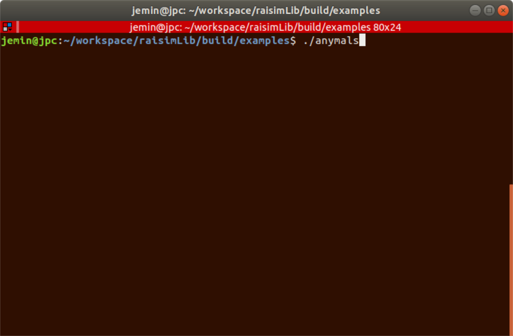
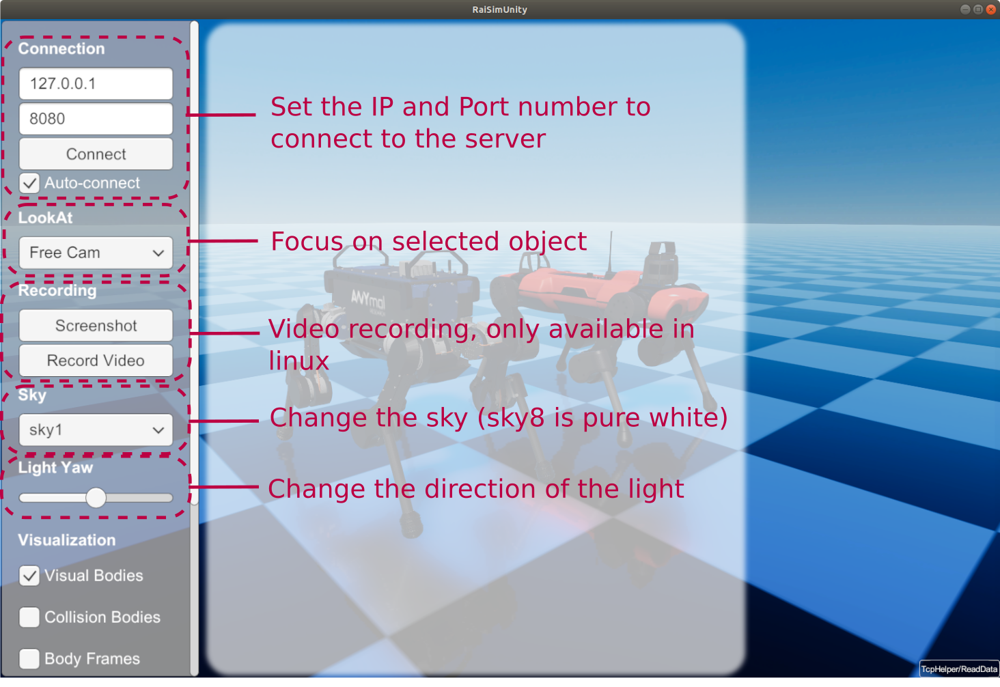
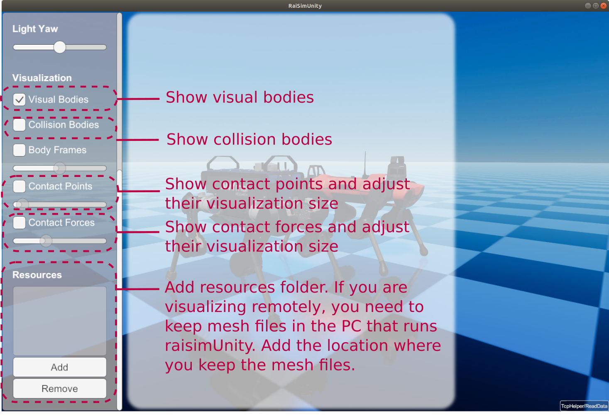
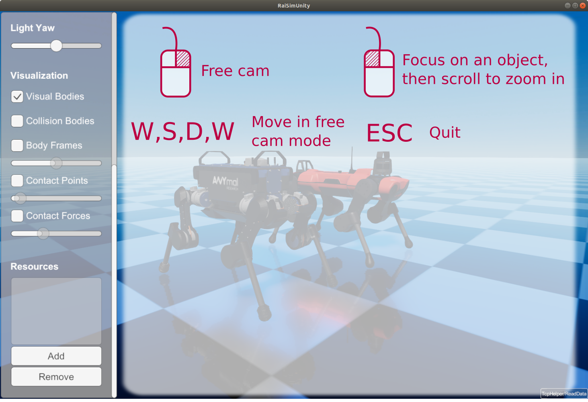

#############################
RaiSimUnity
#############################

raisimUnity is a visualizer for RaiSim.
It communicates with RaiSim using a TCP/IP protocol.
Pre-built executables are provided in ``raisimUnity`` directory.

Prerequisites
========================

* Make sure that you have a vulkan-supported GPU
* In linux, install vulkan libraries following the link here: https://linuxconfig.org/install-and-test-vulkan-on-linux
* In Ubuntu, ``sudo apt install minizip ffmpeg``
* Update your GPU driver. Use either the version recommended by pytorch or the latest one

Give a permission to run the app
====================================
Your OS will mark this app malicious because it does not know who created it.
You can allow OS to run this app in the following ways

In Linux
***********
Open a terminal, go to the ``RaisimUnity/linux directory`` and type

.. code-block:: c

    chmod +x ./raisimUnity.x86_64

In Windows
**************
Double click the app, press "run app anyway"

In Mac
***********************
You will get one of the following messages

* RaiSimUnity can't be opened because it is from an unidentified developer. Your security preferences allow installation of only apps from the App Store and identified developers."
* "RaiSimUnity cannot be opened because the developer cannot be verified."
* "macOS cannot verify that this app is free from malware."

Open the raisimUnity executable location in Finder -> control click the raisimUnity -> open -> open.

How to use raisimUnity
=========================

1. Write your simulated world in RaiSim, create a server and attach the world to the server.
An example is provided below.

.. code-block:: bash

  /// launch raisim server
  raisim::RaisimServer server(&world);
  server.launchServer();

  while(1) {
    raisim::MSLEEP(2);
    server.integrateWorldThreadSafe();
  }

  server.killServer();

2. Run RaiSimUnity executable (in the ``raisimUnity`` directory)

.. image:: ../image/raisimUnity2.png

3. Run your simulation

4. If the IP and port number matches, raisimUnity will try to connect automatically.
You can disable auto-connection by unchecking the ``auto-connect`` checkbox.

.. image:: ../image/raisimUnity4.png

5. A quick summary

Object Appearances
=====================
You can specify the appearance of an object using ``raisim::SingleBodyObject::setAppearanc``.
If you want to hide object completely in RaisimUnity, you can set appearance as ``hidden-unity``.
