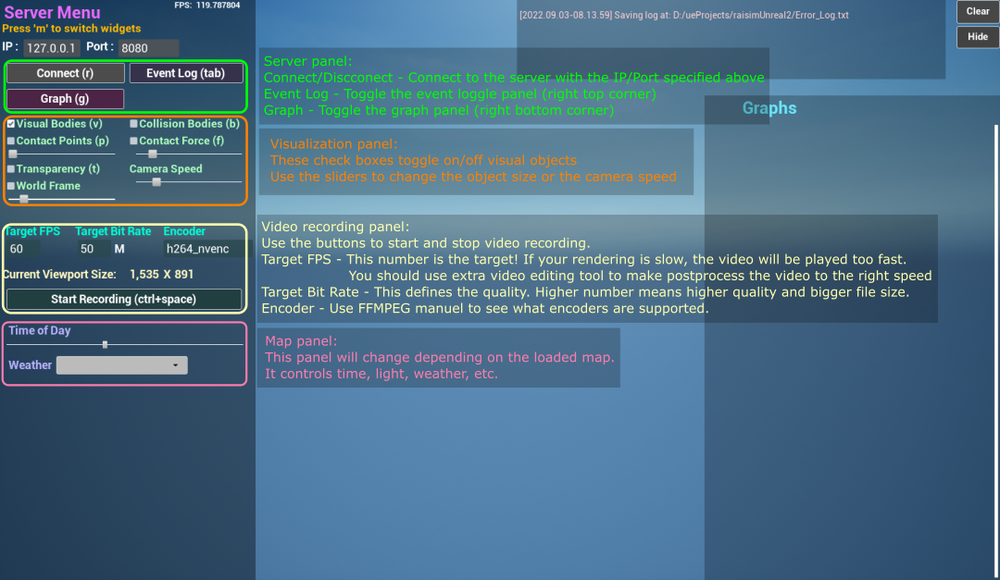

#############################
RaisimUnreal
#############################

Introduction
=====================

RaisimUnreal is a visualization client, just like RaisimUnity.
The simulation process should launch a RaisimServer in order to communicate with RaisimUnreal.
Once the server is running, RaisimUnreal can connect to it and obtain visualization information.

You can get raisimUnreal in the `release tab <https://github.com/raisimTech/raisimLib/releases>`_.
Here are a few example shots from RaisimUnreal

.. image:: ../image/raisimUnreal1.png
  :alt: raisimUnreal1
  :width: 800
|
|
.. image:: ../image/raisimUnreal2.png
  :alt: raisimUnreal2
  :width: 800
|
|
.. image:: ../image/raisimUnreal3.png
  :alt: raisimUnreal3
  :width: 800
|
|
.. image:: ../image/raisimUnreal4.png
  :alt: raisimUnreal4
  :width: 800
|
|
.. image:: ../image/raisimUnreal5.png
  :alt: raisimUnreal5
  :width: 800
|
|
Compared to other visualizers, RaisimUnreal looks absolutely stunning.
However, it is much like video games and you need a good GPU to get high fps.
In windows, Unreal Engine is highly optimized and it can produce high fps.
However, Linux version is not as fast.

Do not use it during training because otherwise it will slow down your training.
It will use 100% of your GPU to get the highest fps.
I prefer to use it for visualization of final policies after training.

To use RaisimUnreal, you do not have to commit anything.
From the server side, it is absolutely the same as raisimUnity.
All you have to do is to create the server instance and launch it (check the examples in ``examples/server``).

User Interface
==========================
There are two topmost menu panels: the main menu and object menu.
You can press ``m`` to switch the menu panel.

The object menu list all objects in the world.
If you click the object name, the camera will focus on that object and the object menu will pop up.

The main menu has the following structure.

Maps
================================
You can use pre-configured maps using raisimUnreal using ``RaisimServer::setMap``.
These maps are visually astonishing but each map takes 1 Gb of storage.
This is a primary reason that RaisimUnreal is so bulky.

You should read the examples in ``examples/src/maps`` to understand how to use them.
Note that some objects have appearance "hidden".
This will ensure that they only present in the simulation world, not in the visualization world.

Currently, the following maps are available.

.. image:: ../image/rsu_maps.png
  :alt: rsu_maps
  :width: 1080

Weather
====================
If you see a dropdown menu on the main menu panel, that means that map supports dynamic weather.
If it does not support dynamic weather, it will support dynamic lighting so that you can move the light sources around.
Weather related computation and visualization are costly and you can use a simpler map such as "simple" if you want to save computational resources.
Here is an example of weather changes

.. image:: ../image/rsu_weather.gif
  :alt: rsu_weather
  :width: 854

If the map support dynamic weather, it also supports "timeOfDay" option. You can drag the scroll bar and specify the current time.

.. image:: ../image/rsu_timeOfDay.gif
  :alt: rsu_tod
  :width: 854

Video recording
=============================
RaisimUnreal uses ``ffmpeg`` to record your screen in Linux and Windows.
You first have to install ffmpeg to use the screen recording feature.
In Windows, make sure that the directory where the ffmpeg executable lives is added to your ``PATH`` environment variable.
This is a standard mechanism that Windows uses to find a necessary executable.

The options in the menu panel are for ffmpeg.
If you are new to ffmpeg, you should learn the options it offers before modifying this feature.

Materials
==================================

A ``SingleBodyObject`` has an appearance attribute which can be set using ``setAppearance()``.
You can use basic colors described as per `here <https://raisim.com>`_.
**If you want to hide the object, you can set the appearance to "hidden".**

RaisimUnreal further provides additional appearances shown below

**marble1**

.. image:: ../image/RUnrealHm_marble1.png
   :alt: raisimUnreal
   :width: 300

**marble2**

.. image:: ../image/RUnrealHm_marble2.png
   :alt: raisimUnreal
   :width: 300

**marble3**

.. image:: ../image/RUnrealHm_marble3.png
  :alt: raisimUnreal
  :width: 300

**marble4**

.. image:: ../image/RUnrealHm_marble4.png
  :alt: raisimUnreal
  :width: 300

**soil1**

.. image:: ../image/RUnrealHm_soil1.png
  :alt: raisimUnreal
  :width: 300

**soil2**

.. image:: ../image/RUnrealHm_soil2.png
  :alt: raisimUnreal
  :width: 300

**wood1**

.. image:: ../image/RUnrealHm_wood1.png
  :alt: raisimUnreal
  :width: 300

**wood2**

.. image:: ../image/RUnrealHm_wood2.png
  :alt: raisimUnreal
  :width: 300

**steel**

.. image:: ../image/RUnrealHm_steel.png
  :alt: raisimUnreal
  :width: 300

Troubleshooting and bug reporting
==================================

RaisimUnreal creates a log file ``Error_Log.txt`` inside the raisimUnreal2 folder.
It it is not working properly, please read the log first.
If you cannot figure it out yourself, you can post an issue with the log file.

