#############################
RaisimUnreal
#############################

Introduction
=====================
RaisimUnreal is a visualization client, just like RaisimUnity.
The simulation process should launch (``raisim::RaisimServer::launchServer``) a RaisimServer in order to communicate with RaisimUnreal.
Once the server is running, RaisimUnreal can connect to it and obtain visualization information.

You can get raisimUnreal in the `release tab <https://github.com/raisimTech/raisimLib/releases>`_.
Here are a few example shots from RaisimUnreal

.. image:: ../image/raisimUnreal1.png
  :alt: raisimUnreal1
  :width: 800
|
|
.. image:: ../image/raisimUnreal2.png
  :alt: raisimUnreal2
  :width: 800
|
|
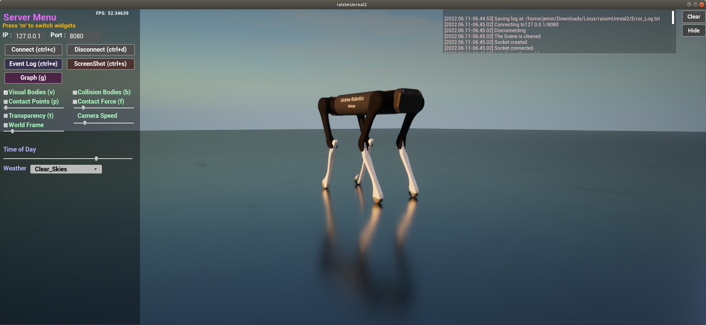
|
|
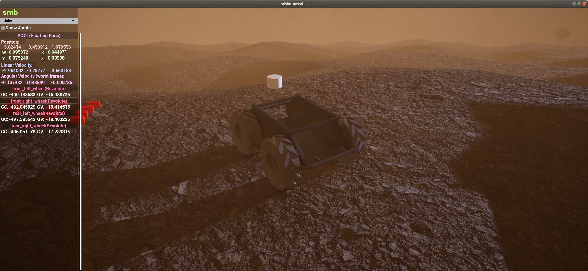
|
|
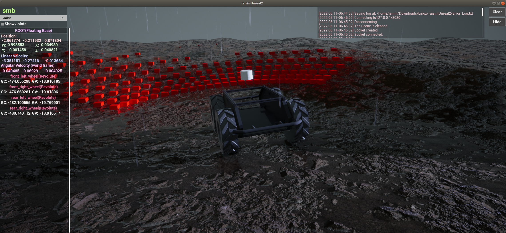
|
|
Compared to other visualizers, RaisimUnreal looks absolutely stunning.
However, it is much like video games and you need a good GPU to get high fps.
In windows, Unreal Engine is highly optimized and it can produce high fps.
However, Linux version is not as fast.

Do not use it during training because otherwise it will slow down your training.
It will use 100% of your GPU to get the highest fps.
I prefer to use it for visualization of final policies after training.

To use RaisimUnreal, you do not have to commit anything.
From the server side, it is absolutely the same as raisimUnity.
All you have to do is to create the server instance (``raisim::RaisimServer``) and launch it (check the examples in ``examples/server``).

Why RaisimUnreal over other alternatives?
=============================================

There are a few features only available in raisimUnreal.

1. Add/remove objects dynamically in the visualizer (object spawner menu and ``del``)
2. Measure distance (``alt``)
3. Apply external force in the visualizer (``shift``)
4. Visualize maps (``raisim::RaisimServer::setMap``)

You can find further descriptions of the features on this page.
In addition, RaisimUnreal has the highest visual fidelity.

Prerequisites
========================

* Make sure that you have a vulkan-supported GPU
* In Linux, install vulkan libraries following the link here: https://linuxconfig.org/install-and-test-vulkan-on-linux
* In Windows, an window will pop up to guide you for installation of dependencies if you run the app.
* **Update your GPU driver. Use either the version recommended by pytorch or the latest one**

Give a permission to run the app
====================================
Your OS will mark this app malicious because it does not know who created it.
You can allow OS to run this app in the following ways

Linux
***********
Open a terminal, go to the ``RaisimUnity/linux directory`` and type

.. code-block:: c

    chmod +x ./raisimUnity.x86_64

Windows
**************
Double click the app, press "run app anyway"

Requirements
==========================

Windows
*********************
If you run the raisimUnreal app, it will guide you for installation of dependencies.

Linux
*********************
* Ubuntu 20.04 or higher (18.04 also works but it will be painful to get all package versions right)
* Vulkan: Follow the instructions in this link https://linuxconfig.org/install-and-test-vulkan-on-linux
* Latest graphics driver. If you use pytorch, use the driver version that Cuda installs. (The driver will be installed if you follow their instructions.). Otherwise, use the latest version.

User Interface
==========================
There are three topmost menu panels: the main menu, object list menu, and object spawner menu.
You can press ``m`` to switch the menu panel or to hide them.

The **main menu** contains connection-related widgets, visualization related-widgets, and interaction-related widgets.
Most of the widget items have a corresponding a keyboard binding.

The **object list menu** list all objects in the world.
You can click the object button to focus on the object.
You can also type in the search bar to find an object with a specific name (the name can be set by ``raisim::Object::setName``).

The **object spawner menu** allows you to spawn new objects in the map.
You can set the initial state of the object as well.

There are also a few sub-menus which can be created at need.

The **object menu** is created when an object is focused.
You can focus on an object by clicking either the object in the scene or the object button in the object list menu to select an object.
You can also focus on an object from the server side using ``raisim::RaisimServer::focusOn``.
Once the object is focused, you can read about states of the object, frames associated with the object, and joints of the object.

The **event menu** is created when you press ``tab``.
It lists events happened during the execution.
It might be useful for debugging.

The **graph menu** is created when you press ``g``.
It lists all graphs specified by the server (read the atlas.cpp example for details).

Interaction
=================

Object deletion
*********************
You can delete the focused object using ``del`` key.
You can focus on an object using either by left-clicking the object or by selecting an object in the object list menu.

Object spawning
*********************
You can find an object spawner menu by pressing ``m`` key a few times.
There are 8 different objects you can spawn.
Click on the object you want to spawn and fill in the other parameters that are activated in the object spawner menu.
Press ``enter`` or just click on the button to spawn the object.

Apply force
*********************
You can apply external forces by pressing ``shift`` and dragging the object.
The force model is a spring so it will apply the force proportional to the distance you dragged.
Once you release the left-mouse-button, it will stop applying the force.

Measure position or distance
************************************
You can press ``alt`` and ``left-click`` on an object to specify a *point of interest*.
If there is one *point of interest*, the ruler will measure a position.
If there are two, the ruler will measure the displacement.

Maps
================================
You can use pre-configured maps using raisimUnreal using ``RaisimServer::setMap``.
These maps are visually astonishing but each map takes 1 Gb of storage.
This is a primary reason that RaisimUnreal is so bulky.

You should read the examples in ``examples/src/maps`` to understand how to use them.
Note that some objects have appearance "hidden".
This will ensure that they only present in the simulation world, not in the visualization world.

Currently, the following maps are available.

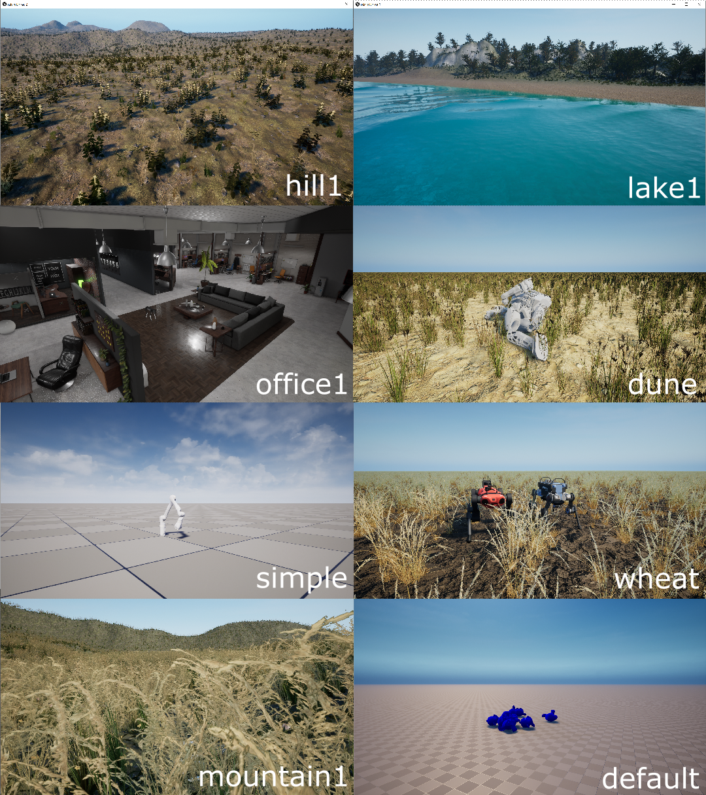

You can purchase a custom map.
If you send a description of the site and necessary pictures, we will send you a quote.
Note that the map can be as good as the data you provide.

Weather
====================
If you see a dropdown menu for weather on the main menu panel, that means that map supports dynamic weather.
If it does not support dynamic weather, it will support dynamic lighting so that you can move the light source around.
Weather related computation and visualization are costly and you can use a simpler map such as "simple" if you want to save computational resources.

Here is an example of weather changes

.. image:: ../image/rsu_weather.gif
  :alt: rsu_weather
  :width: 854

If the map support dynamic weather, it also supports "timeOfDay" option. You can drag the scroll bar and specify the current time.

.. image:: ../image/rsu_timeOfDay.gif
  :alt: rsu_tod
  :width: 854

Video recording
=============================
RaisimUnreal uses ``ffmpeg`` to record your screen in Linux and Windows.
You first have to install ffmpeg to use the screen recording feature.
In Windows, make sure that the directory where the ffmpeg executable lives is added to your ``PATH`` environment variable.
This is a standard mechanism that Windows uses to find a necessary executable.

The options in the menu panel are for ffmpeg.
If you are new to ffmpeg, you should learn the options it offers before modifying this feature.

Materials
==================================

A ``SingleBodyObject`` has an appearance attribute which can be set using ``setAppearance()``.
You can use basic colors described as per `here <https://raisim.com>`_.
**If you want to hide the object, you can set the appearance to "hidden".**

RaisimUnreal further provides additional appearances shown below

**marble1**

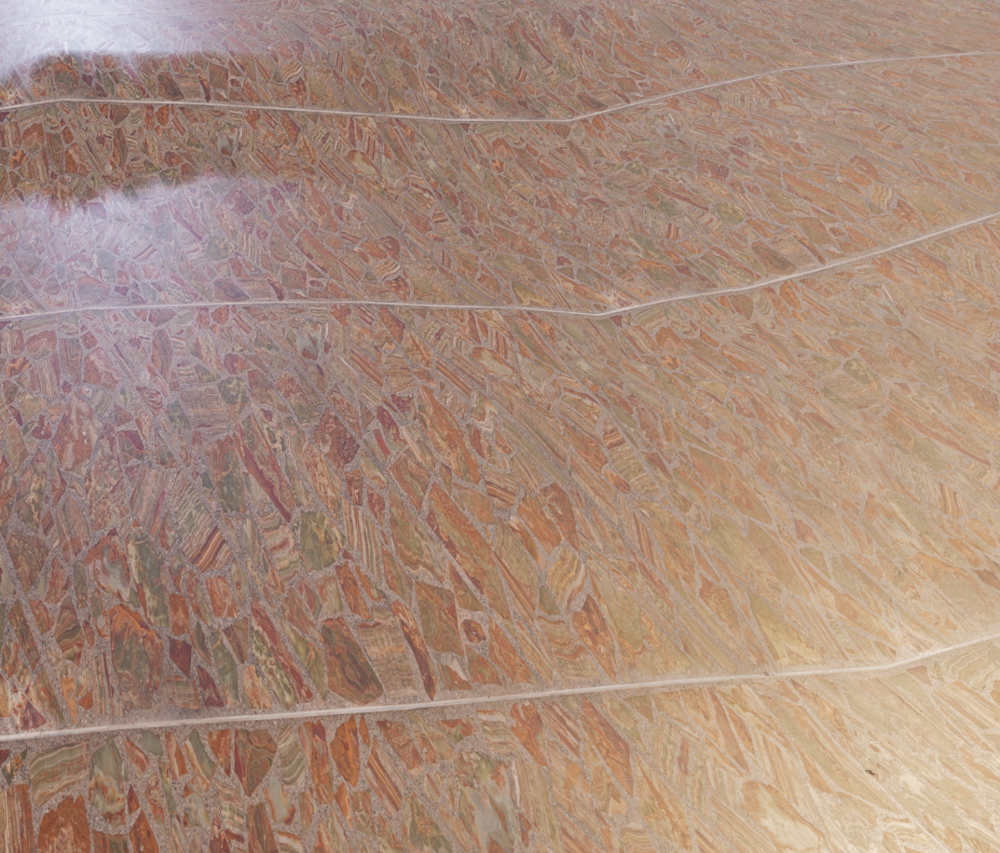

**marble2**

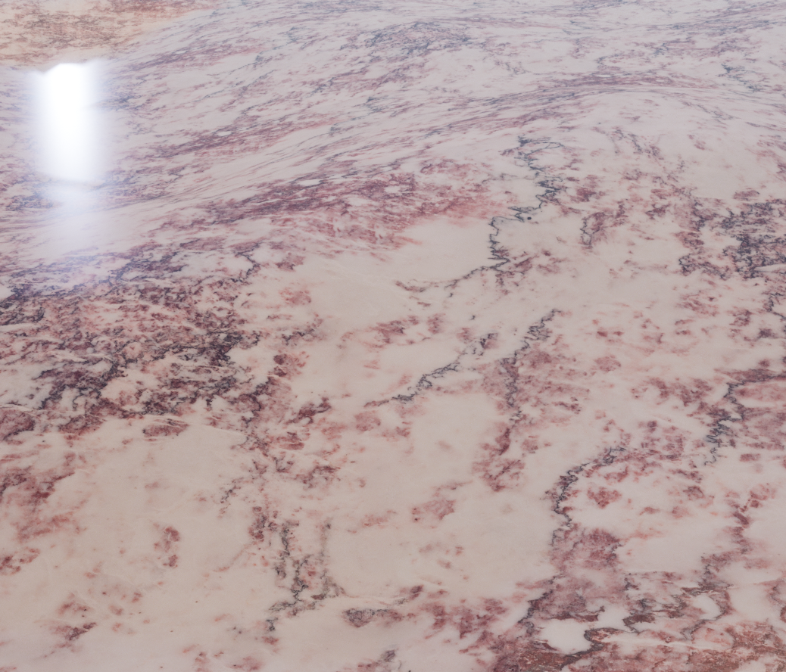

**marble3**

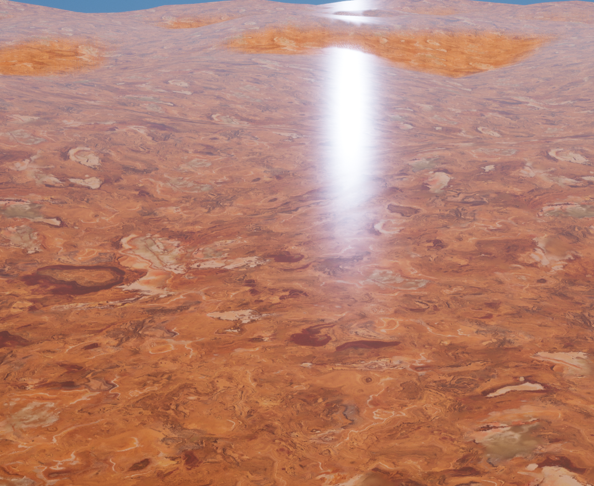

**marble4**

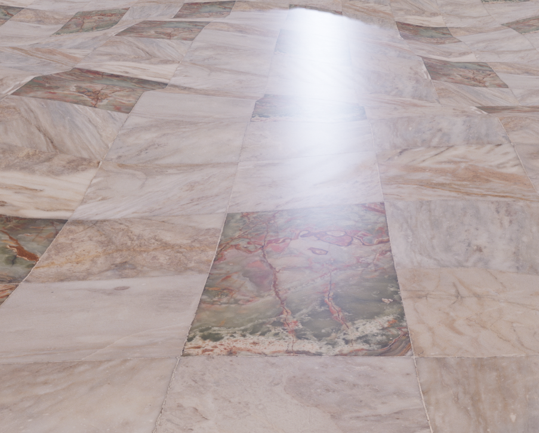

**soil1**

.. image:: ../image/RUnrealHm_soil1.png
  :alt: raisimUnreal
  :width: 300

**soil2**

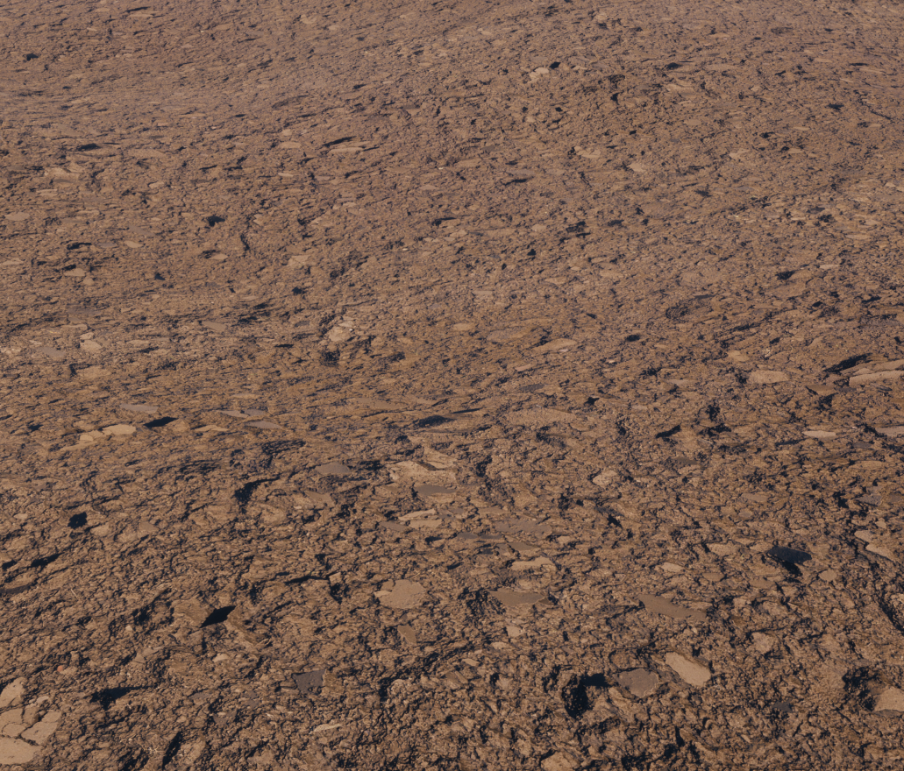

**wood1**

.. image:: ../image/RUnrealHm_wood1.png
  :alt: raisimUnreal
  :width: 300

**wood2**

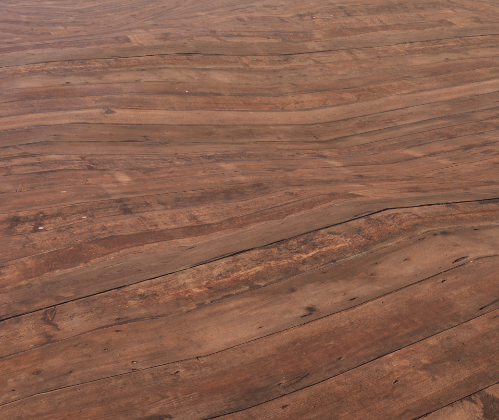

**steel**

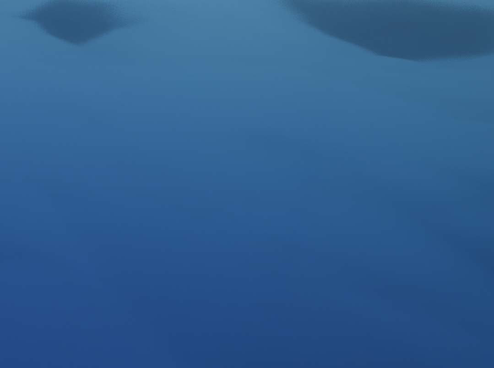

Troubleshooting and bug reporting
==================================

RaisimUnreal creates a log file ``Error_Log.txt`` inside the raisimUnreal2 folder.
If RaisimUnreal is not working properly, please read the log first.
If you cannot figure it out yourself, you can post an issue with the log file.

