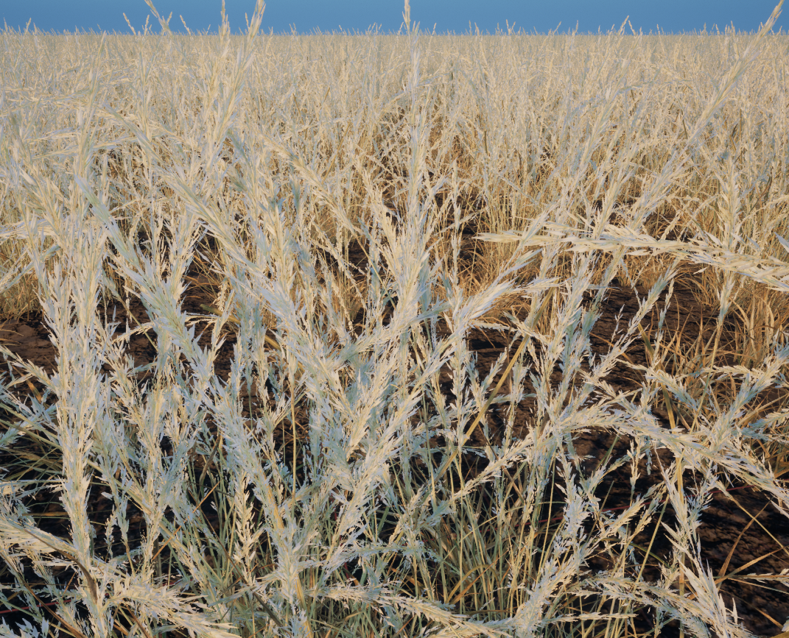
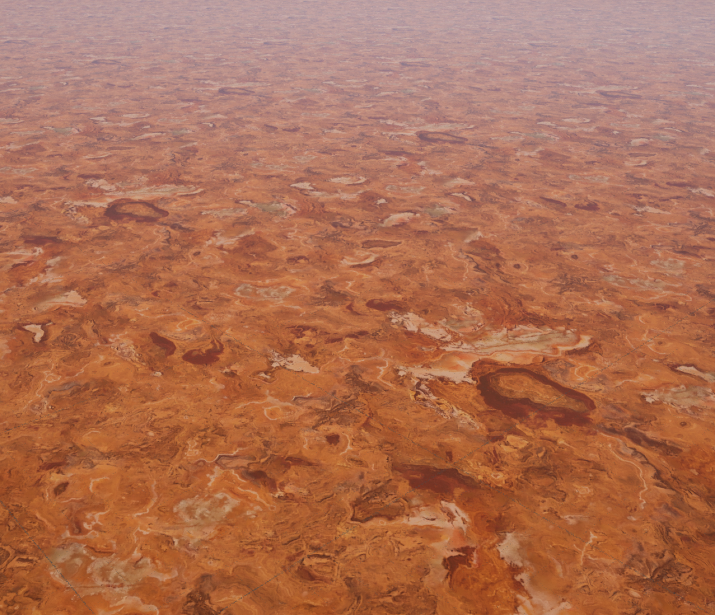
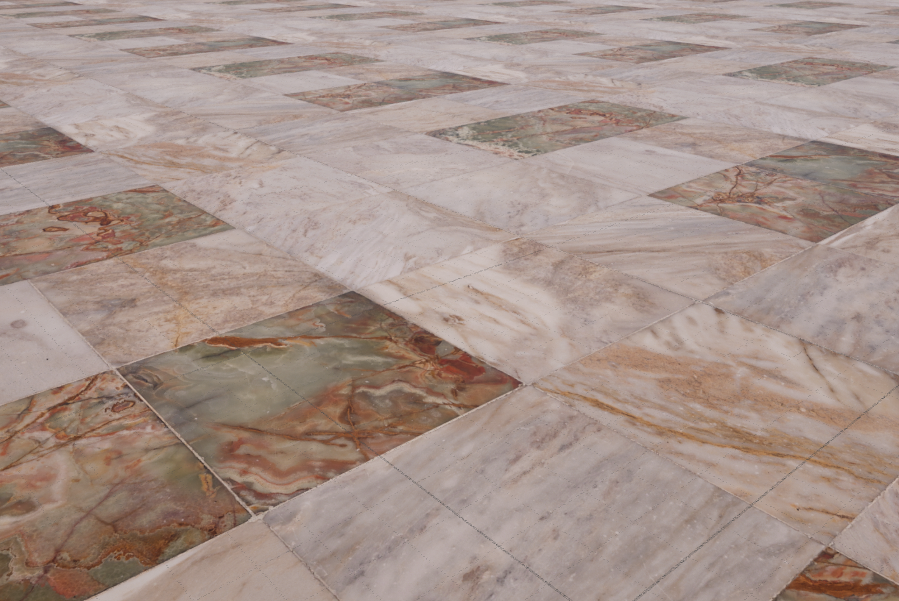
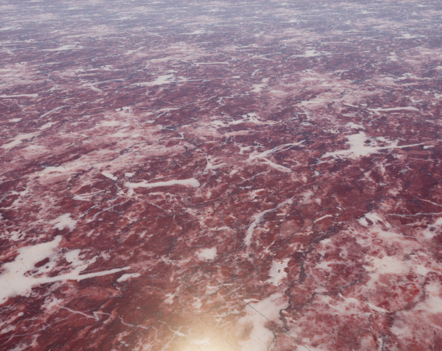
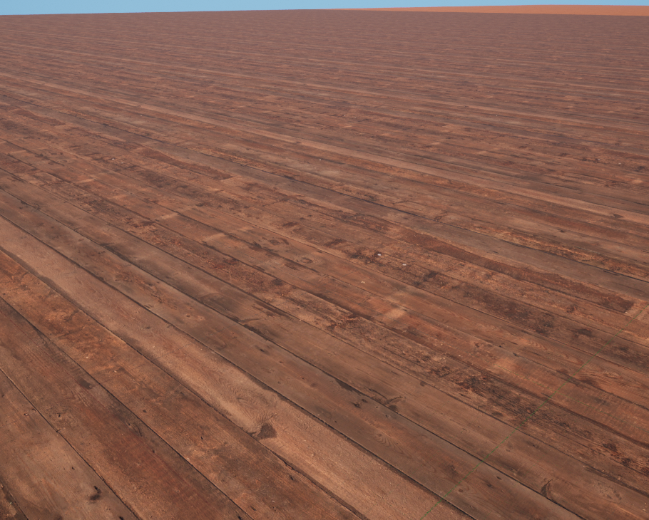
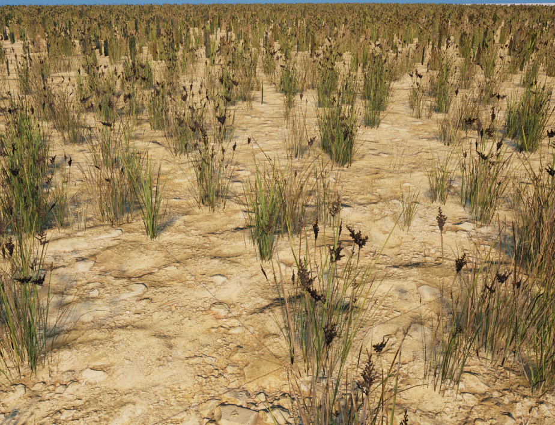
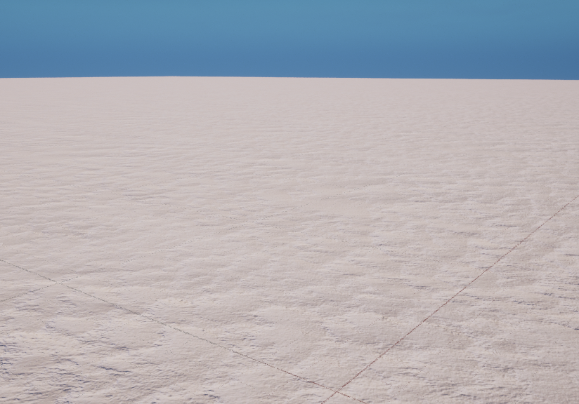

#############################
RaisimUnreal
#############################

Introduction
=====================

RaisimUnreal is a visualization client, just like RaisimUnity.
The simulation process should launch a RaisimServer in order to communicate with RaisimUnreal.
Once the server is running, RaisimUnreal can connect to it and obtain visualization information.

You can get raisimUnreal in the `release tab <https://github.com/raisimTech/raisimLib/releases>`_.
Here are a few example shots from RaisimUnreal

.. image:: ../image/raisimUnreal1.png
  :alt: raisimUnreal1
  :width: 800
|
|
.. image:: ../image/raisimUnreal2.png
  :alt: raisimUnreal2
  :width: 800
|
|
.. image:: ../image/raisimUnreal3.png
  :alt: raisimUnreal3
  :width: 800
|
|
.. image:: ../image/raisimUnreal4.png
  :alt: raisimUnreal4
  :width: 800
|
|
.. image:: ../image/raisimUnreal5.png
  :alt: raisimUnreal5
  :width: 800
|
|
Compared to other visualizers, RaisimUnreal looks absolutely stunning.
However, it is much like video games and you need a good GPU to get high fps.
In windows, Unreal is highly optimized and it can produce high fps.
However, Linux version is not as fast.

Do not use it during training because otherwise it will slow down your training.
It will use 100% of your GPU to get the highest fps.
I prefer to use it for visualization of final policies after training.

To use RaisimUnreal, you do not have to commit anything.
From the server side, it is absolutely the same as raisimUnity.
All you have to do is to create the server instance and launch it (check the examples in ``examples/server``).

Textures/Types
==================================

You can set complex appearance (i.e., types/textures) on ``Ground`` and ``HeightMap``.
The available appearances are as shown

Ground
----------

"wheat"

"marble1"

"marble2"

"marble3"

"wood1"

.. image:: ../image/RUnrealterrain_wood2.png
  :alt: raisimUnreal
  :width: 400
"wood2"

"dune"

"snow"

.. image:: ../image/RUnrealterrain_steel.png
  :alt: raisimUnreal
  :width: 400
"steel"

Heightmap
----------
.. image:: ../image/RUnrealHm_marble1.png
  :alt: raisimUnreal
  :width: 400
"marble1"

.. image:: ../image/RUnrealHm_marble2.png
  :alt: raisimUnreal
  :width: 400
"marble2"

.. image:: ../image/RUnrealHm_marble3.png
  :alt: raisimUnreal
  :width: 400
"marble3"

.. image:: ../image/RUnrealHm_marble4.png
  :alt: raisimUnreal
  :width: 400
"marble4"

.. image:: ../image/RUnrealHm_soil1.png
  :alt: raisimUnreal
  :width: 400
"soil1"

.. image:: ../image/RUnrealHm_soil2.png
  :alt: raisimUnreal
  :width: 400
"soil2"

.. image:: ../image/RUnrealHm_wood1.png
  :alt: raisimUnreal
  :width: 400
"wood1"

.. image:: ../image/RUnrealHm_wood2.png
  :alt: raisimUnreal
  :width: 400
"wood2"

.. image:: ../image/RUnrealHm_steel.png
  :alt: raisimUnreal
  :width: 400
"steel"

Troubleshooting and bug reporting
==================================

RaisimUnreal creates a log file ``Error_Log.txt`` inside the raisimUnreal2 folder.
It it is not working properly, please read the log first.
If you cannot figure it out yourself, you can post an issue with the log file.

