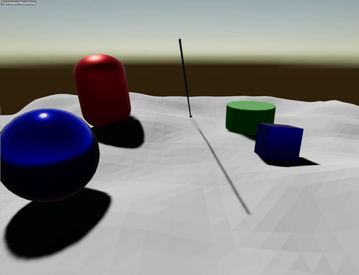

#############################
Ray Test
#############################

Ray test is a collision checker between the world and a ray.
Users should specify the starting point, direction and length. It returns the colliding objects and the distance.

Example
========================================

An example is provided `here <https://github.com/raisimTech/raisimLib/blob/master/examples/src/server/rayDemo.cpp>`_.
Note that only the following line

.. code-block:: c++

    auto& col = world.rayTest({0,0,5}, direction, 50., true);

performs the ray test. The rest of the code is for demo only.

