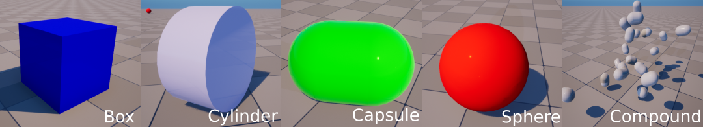

#############################
Single-Body Objects
#############################

``raisim::SingleBodyObject`` is an object with only one rigid body.
``raisim::Compound`` object is is also a SingleBodyObject because its components move together as one rigid body.
All SingleBodyObjects has **6 degrees of freedom**: 3 for position and 3 for orientation.

Supported Shapes
=========================
The following 5 shapes are supported in Raisim.

Compound
===================================
An example can be found `here <https://raisim.com/sections/RaisimUnity.html>`_.

``raisim::Compound`` has multiple primitive shapes that are rigidly attached to each other to form a single rigid body.
The shapes do not have to overlap to stay attached.

A compound object can be added to world using the method ``raisim::World::addCompound``.
This method takes a vector of child, which have their own shape, material, position and orientation.
The shape can be specified by a geometric type (i.e., ``raisim::ObjectType``) and its size parameters (``objectParam``).
The ``objectParam`` follows a standard way to represent size of a primitive in Raisim, which is

*  Sphere: radius, 0, 0, 0
*  Box: x, y, z, 0
*  Capsule and cylinder: radius, height, 0, 0

The ``objectParam`` is an instance of ``raisim::Vec<4>``.
All shapes require less than 4 parameters and the unnecessary elements (i.e., the zeroes above) are ignored.

The ``trans`` member defines the position and orientation of the child in the body frame.
It is a ``struct`` instance which has ``rot`` and ``pos`` members as public.

The following arguments, ``mass``, ``COM`` and ``inertia``, specify the dynamical properties of the combined body.

SingleBodyObject API (Parent class)
======================================

.. doxygenclass:: raisim::SingleBodyObject
   :members:

Compound API
=========================

.. doxygenclass:: raisim::Compound
   :members:

Sphere API
=========================

.. doxygenclass:: raisim::Sphere
   :members:

Box API
=========================

.. doxygenclass:: raisim::Box
   :members:

Capsule API
=========================

.. doxygenclass:: raisim::Capsule
   :members:

Cylinder API
=========================

.. doxygenclass:: raisim::Cylinder
   :members:

Ground API
=========================

.. doxygenclass:: raisim::Ground
   :members: