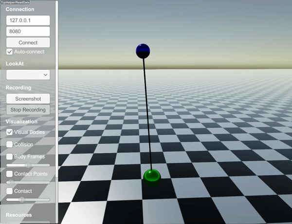
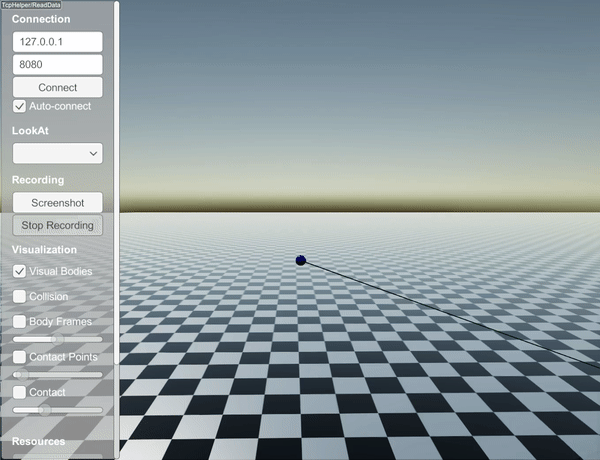

StiffLengthConstraint
===========================

``StiffLengthConstraint`` is treated as a collision and solved using a contact solver.
This ensures that the constraint is respected with a high accuracy but it is computationally costly (as if there is one more collision).

``StiffLengthConstraint`` can be added between two objects as

.. code-block:: c

  auto pin1 = world.addSphere(0.1, 0.8);
  pin1->setPosition(0.0, 0.0, 3.0);
  pin1->setBodyType(raisim::BodyType::STATIC);
  auto ball1 = world.addSphere(0.15, 0.8, "steel");
  ball1->setPosition(0.0, 0.1, 2.0);
  auto wire = world.addStiffWire(pin1, 0, {0,0,0}, ball1, 0, {0,0,0}, 2.0);

By default, this constraint is ``STRETCH_RESISTANT_ONLY``, which means that it acts like a string (i.e., it cannot push).
Above code will create dynamics shown below

The type can be changed with the following command

.. code-block:: c

  wire->setStretchType(raisim::LengthConstraint::StretchType::COMPRESSION_RESISTANT_ONLY);

By appending the above code and moving the ball higher, the simulation changes to

The following code

.. code-block:: c

  wire->setStretchType(raisim::LengthConstraint::StretchType::BOTH);

results in

This option resists both compression and stretch.
