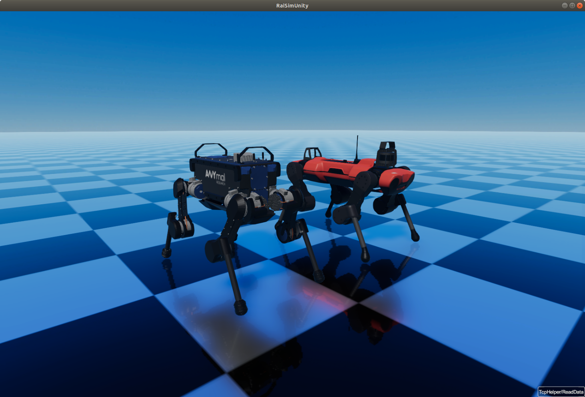
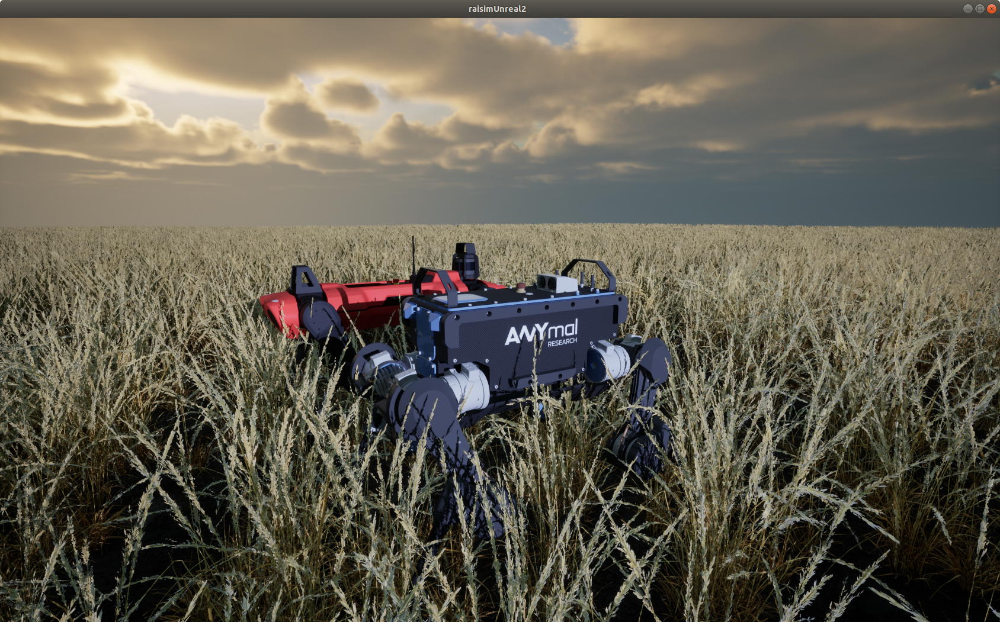
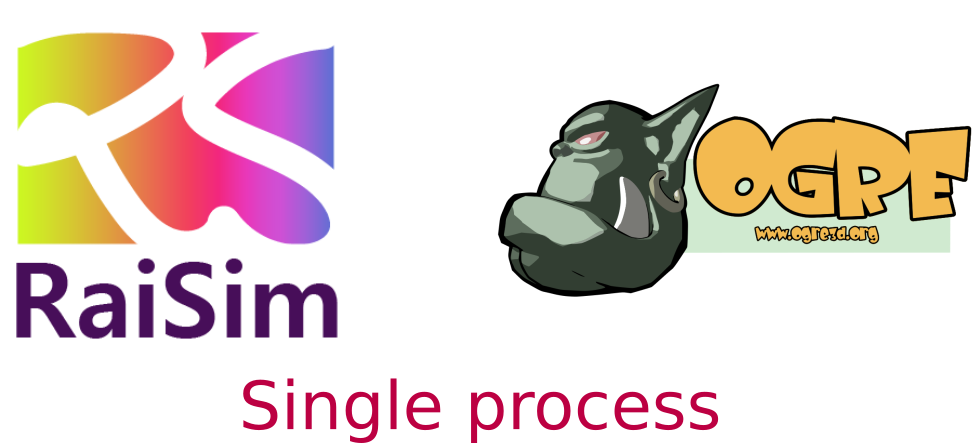

#############################
Visualizers
#############################

There are three options available for visualization.
All examples included in this repo require a server visualizer, such as RaisimUnity and RaisimUnreal.
You have to run one of the server visualizers to visualize what's happening in the simulated world.
This website contains documentations for RaisimUnity and RaisimUnreal.
RaisimOgre documentations and examples are included in the `RaisimOgre repo <https://github.com/raisimTech/raisimogre>`_.

How to choose a visualizer? (Short version)
***********************************************

If you only work in Linux and you want to customize the visualizer -- RaisimOgre.

If you want a simple solution that works well across all OS's -- RaisimUnity.

If you have only an integrated GPU and you work in Linux -- RaisimUnityOpenGL.

If you want the most versatile solution, if you want good graphics for your publication or if you use vision data for your reinforcement learning project -- RaisimUnreal.

How to choose a visualizer? (Long version)
*********************************************

RaisimUnity
======================

*  Binaries included in the ``raisimUnity`` directory
*  Easy to use
*  FPS is low but it consumes your computer resource less than RaisimUnreal.
*  Runs on a separate process (using RaisimServer)
*  Closed source
*  Works well in Linux, Mac and Windows

RaisimUnreal - Beta
=====================

*  Binaries are available in the github release
*  Currently available **only in Windows and Linux**
*  Most complete visualizer. Only RaisimUnreal supports "Maps" (Check out RaisimUnreal section)
*  It uses multi-threading and fast. But this also means that it can **slow down your RL training or simulation**.
*  Easy to use.
*  Can visualize graphs and bar charts (Check out atlas.cpp example.)
*  Runs on a separate process (using RaisimServer)
*  Closed source

RaisimOgre
=====================

*  Harder to use
*  Works well **only in Linux**. Should work in other two major OS's but not tested
*  Easy to customize. Only C++ code
*  Source code available `here <https://github.com/raisimTech/raisimogre>`_ under the MIT license

Comparison between RaisimUnity and RaisimUnreal
======================================================

Here is a comparison between RaisimUnity and RaisimUnreal.

*  **Graphics Quality (my personal opinion)**

   *  **RaisimUnity**: 7/10.
   *  **RaisimUnreal**: 10/10 (Somehow the quality is lower in Linux. This might be due to a driver issue.).

*  **Compatibility**

   *  **RaisimUnity**: There is an alternate Opengl version for compatibility because many old or integrated GPU's do not have a proper vulkan-supporting GPU driver on Linux.
   *  **RaisimUnreal**: Not tested at all. I need your feedback on this. If you find issues, please post it on the github issue.

*  **GPU utilization (based on a few examples on my pc)**

   *  **RaisimUnity**: 90%.
   *  **RaisimUnreal**: 98% (it runs much faster in Windows. It seems like the Unreal Engine is not working well on Linux. In addition, the weather preset affects the performance significantly).

*  **GPU memory usage (with raisim examples)**

   *  **RaisimUnity**: ~2Gb.
   *  **RaisimUnreal**: ~2Gb.

*  **Mesh loading time**

   *  **RaisimUnity**: Very fast.
   *  **RaisimUnreal**: Terribly slow! It also lacks a mechanism for instancing a mesh. This means that if you have 100 robots in the scene, it will create the same meshes 100 times.

*  **Support**

   *  **RaisimUnity**: Will be supported and bug-fixed.
   *  **RaisimUnreal**: New visualization developments will be on raisimUnreal as it seems like a more promising option.

*  **Graphs (time series and bar charts)**

   *  **RaisimUnity**: none.
   *  **RaisimUnreal**: RaisimUnreal uses Kantan Chart to visualize user created graphs from the server. It can be a convenient way to visualize the training process. Check the ``examples/atlas.cpp`` for usage.

*  **Vidoes Recording**

   *  **RaisimUnity**: Works in Linux.
   *  **RaisimUnreal**: Works well in both Linux and Windows.

*  **Object Interactions**

   * **RaisimUnity**: Not supported.
   * **RaisimUnreal**: You can apply force, measure distance and spawn/delete objects
