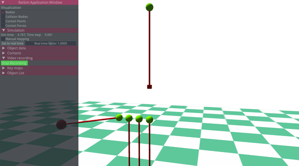
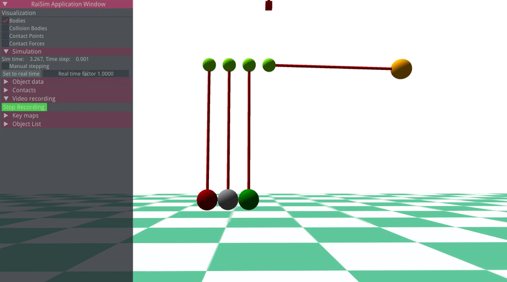

#############################
World
#############################
:code:`raisim::World` class creates/manages all resources.
All objects defined in the same Wolrd class instance can collide with each other unless otherwise their collision mask and group explicitly disables the collision ().

There are two ways to generate the World instance (i.e., two constuctors).
The first way is to load an raisim world configuration file, which is in a form of an XML file.
The second way is to generate world dynamically in code.
You can also mix the two ways, by loading an XML file and dynamically adding objects.

RaiSim World Configuration File Convention
=============================================

Adding New Objects
============================
To add a new object of a shape X, a method named :code:`addX` is used.
For example, to add a sphere

.. code-block:: c

  raisim::World world;
  auto sphere = world.addSphere(0.5, 1.0);

Here :code:`sphere` is a pointer to the internal resource.
It can be used to access or to modify the internal variables.

There are three hidden arguments to all object-creation methods: :code:`material`, :code:`collisionGroup` and :code:`collisionMask`.
Descriptions of the collision varaibles are given in "Collision and Contact" chapter.
:code:`material` argument specifies the material which governs contact dynamics.
It is further explained in "Material System" chapter.

The list of objects is given in "Object" chapter.

Once an object is added, a name can be set as below

.. code-block:: c

  sphere.setName("ball");

A pointer to an object with a specific name can be retrieved as below

.. code-block:: c

  auto ball = world.getObject("ball");

An object might contain multiple bodies (i.e., articulated system).
To designate each body, **local index** can be used.
To keep the interface consistent, many methods ask for the local index even for simgle body objects.
In a single body object case, local index arguments are ignored and users can simply put 0 to comply with the AIP.

Adding constraints
===============================
RaiSim Offers two types of constraints: stiff wire constraint and soft wire constraint.
Wire constraints are unilateral; they can only pull.
Stiff wire is a hard constraint and solved using the contact solver.
Soft wire is a soft constraint and acts like a spring when compressed.

Wires are defined by which bodies they are attached to (both global and local indicies), at what position they are attached in the respective body frames and the length.
Compliant wire has one more protpery which is stiffness.

Here are a couple of examples of wires visualized in RaiSim Ogre.

Changing Simulation Parameters
================================
The following paramters can be changed using the world API

* **Time step**

RaiSim uses a fixed time step. The time step obtained and modified using :code:`getTimeStep` and :code:`setTimeStep` method.

API
=========
.. doxygenclass:: raisim::World
   :members: